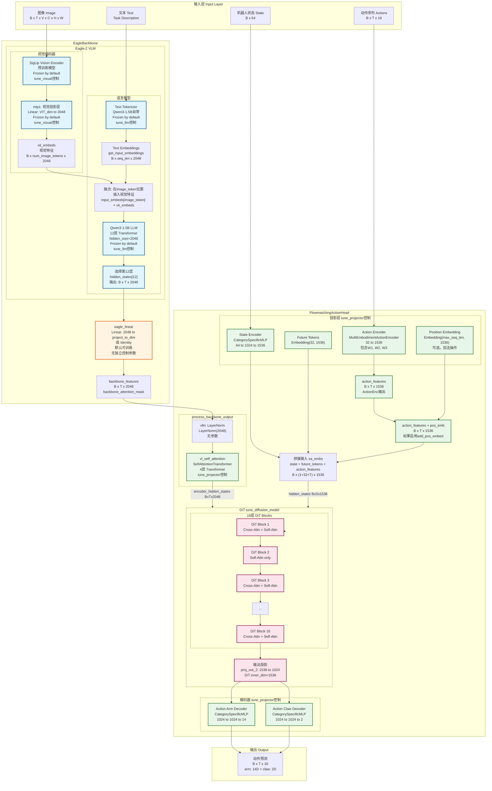

# GROOT N1.5 详细架构图

## 完整数据流和模块结构


## 关键维度变化

| 位置 | 模块 | 输入维度 | 输出维度 | 说明 |
|------|------|---------|---------|------|
| **EagleBackbone** |
| Vision Encoder | SigLip | B×T×V×C×H×W | B×T×V×patches×VIT_dim | 图像编码 |
| mlp1 | Linear | VIT_dim | 2048 | 视觉特征投影 |
| LLM | Qwen3-1.5B | B×T×vocab | B×T×2048 | 文本编码 |
| Select Layer | hidden_states[12] | B×T×2048 | B×T×2048 | 选择第12层 |
| eagle_linear | Linear/Identity | 2048 | 2048或project_to_dim | 可选投影 |
| **FlowmatchingActionHead** |
| vlln | LayerNorm | B×T×2048 | B×T×2048 | 归一化 |
| vl_self_attention | SelfAttn×4 | B×T×2048 | B×T×2048 | 自注意力处理 |
| State Encoder | CategoryMLP | B×64 | B×1×1536 | 状态编码 |
| Action Encoder | MultiEmbMLP | B×T×32 | B×T×1536 | 动作编码 |
| Future Tokens | Embedding | - | B×32×1536 | 未来token |
| DiT Input | Concat | - | B×(1+32+T)×1536 | 拼接 |
| DiT Cross-Attn | Attention | encoder: B×T×2048<br/>query: B×S×1536<br/>to_k/to_v: 2048→1536 | B×S×1536 | 交叉注意力 |
| DiT Self-Attn | Attention | B×S×1536 | B×S×1536 | 自注意力 |
| DiT Output | proj_out_2 | B×S×1536 | B×S×1024 | 输出投影(inner_dim→output_dim) |
| Model Output Actions | Slice | B×S×1024 | B×T×1024 | 只取action部分 |
| Action Decoders | CategoryMLP | B×T×1024 | B×T×14/2 | 动作解码 |

## 微调参数控制

### tune_visual (Backbone)
- ✅ `vision_model` (SigLip)
- ✅ `mlp1` (视觉投影层)

### tune_llm (Backbone)
- ✅ `language_model` (Qwen3-1.5B)
- ✅ `get_input_embeddings()` (文本tokenizer的embedding层)

### tune_projector (Action Head)
- ✅ `vl_self_attention` (SelfAttentionTransformer, 4层)
- ✅ `state_encoder` (CategorySpecificMLP)
- ✅ `action_encoder` (MultiEmbodimentActionEncoder)
- ✅ `position_embedding` (如果启用)
- ✅ `action_arm_decoder` / `action_claw_decoder` (或 `action_decoder`)

### tune_diffusion_model (Action Head)
- ✅ `model` (DiT, 16层)
  - 包括所有DiT Block中的Cross-Attention和Self-Attention
  - 包括DiT内部的to_k, to_v投影层
  - 包括proj_out_1, proj_out_2输出投影

### 默认可训练（无独立控制）
- ✅ `eagle_linear` (EagleBackbone中的投影层)

## 详细数据流说明

### 1. LLM输出到DiT的路径

```
Qwen3-1.5B LLM (2048维)
    ↓
hidden_states[12] (B×T×2048)
    ↓
eagle_linear (可选: 2048→project_to_dim)
    ↓
backbone_features (B×T×2048)
    ↓
vlln: LayerNorm (B×T×2048)
    ↓
vl_self_attention: SelfAttentionTransformer×4 (B×T×2048)
    ↓
作为 encoder_hidden_states 传入 DiT
    ↓
DiT Cross-Attention 的 to_k, to_v 投影层
    ↓
与 query (state+future+action tokens) 进行交叉注意力
```

### 2. vl_self_attention的位置和作用

`vl_self_attention` 位于 `process_backbone_output()` 方法中，在 `vlln` 之后：

```python
def process_backbone_output(self, backbone_output: BatchFeature):
    backbone_features = backbone_output["backbone_features"]  # B×T×2048
    backbone_features = self.vlln(backbone_features)           # LayerNorm
    backbone_features = self.vl_self_attention(backbone_features)  # SelfAttn×4
    return backbone_output
```

**作用**：
- 对backbone输出的视觉-语言特征进行自注意力处理
- 帮助模型更好地理解视觉和文本的联合表示
- 由 `tune_projector` 控制是否训练

### 3. DiT中的Cross-Attention机制

DiT的每个Block（除了interleaved的self-attention only层）都包含Cross-Attention：

```
DiT Block:
  ├─ Cross-Attention
  │   ├─ Query: hidden_states (state+future+action tokens, 1536维)
  │   ├─ Key: encoder_hidden_states (backbone_features, 2048维)
  │   └─ Value: encoder_hidden_states (backbone_features, 2048维)
  │       └─ to_k, to_v: Linear(2048→1536) 投影层
  └─ Self-Attention
      └─ Query, Key, Value: hidden_states (1536维)
```

## 模块层级结构

### EagleBackbone
```
EagleBackbone
├─ eagle_model (Eagle-2 VLM)
│   ├─ vision_model (SigLip)
│   │   └─ 多层视觉编码器
│   ├─ mlp1
│   │   └─ Linear: VIT_dim → 2048
│   └─ language_model (Qwen3-1.5B)
│       ├─ get_input_embeddings()
│       └─ model.layers[0-11] (12层)
│           └─ 每层: Self-Attn + MLP
└─ eagle_linear
    └─ Linear: 2048 → project_to_dim (或 Identity)
```

### FlowmatchingActionHead
```
FlowmatchingActionHead
├─ process_backbone_output()
│   ├─ vlln: LayerNorm(2048)
│   └─ vl_self_attention: SelfAttentionTransformer
│       └─ 4层 Transformer Blocks
│           └─ 每层: Self-Attention + FeedForward
├─ Projectors (tune_projector)
│   ├─ state_encoder: CategorySpecificMLP
│   │   └─ Layer1: Linear(64→1024) + ReLU
│   │   └─ Layer2: Linear(1024→1536)
│   ├─ action_encoder: MultiEmbodimentActionEncoder
│   │   ├─ W1: Linear(32→1536)
│   │   ├─ W2: Linear(3072→1536) + Swish
│   │   └─ W3: Linear(1536→1536)
│   ├─ position_embedding: Embedding(max_seq_len, 1536)
│   └─ future_tokens: Embedding(32, 1536)
├─ DiT (tune_diffusion_model)
│   ├─ timestep_encoder
│   ├─ transformer_blocks (16层)
│   │   └─ 每层: BasicTransformerBlock
│   │       ├─ Cross-Attention (to_k, to_v投影；encoder 2048→1536)
│   │       └─ Self-Attention (1536)
│   ├─ norm_out: LayerNorm(1536)
│   ├─ proj_out_1: Linear(1536→3072)
│   └─ proj_out_2: Linear(1536→1024)
└─ Decoders (tune_projector)
    ├─ action_arm_decoder: CategorySpecificMLP
    │   └─ Layer1: Linear(1024→1024) + ReLU
    │   └─ Layer2: Linear(1024→14)
    └─ action_claw_decoder: CategorySpecificMLP
        └─ Layer1: Linear(1024→1024) + ReLU
        └─ Layer2: Linear(1024→2)
```

