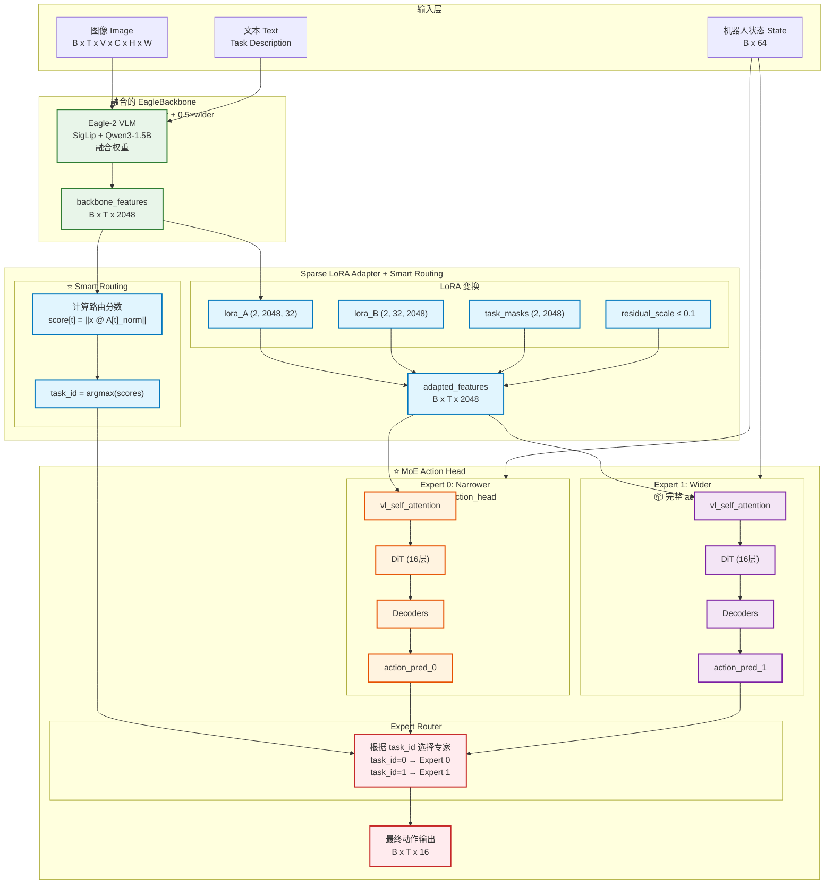

# GROOT N1.5 详细架构图

## Action Space 支持

GROOT N1.5 支持三种 action space 类型：

1. **Absolute joint** (默认): 16D = left_arm(7D) + right_arm(7D) + claw(2D)
   - 左右手各7个关节角度
   - 爪子开合程度

2. **Absolute eef**: 20D = left_eef(9D) + right_eef(9D) + claw(2D)
   - left_eef: 3D position (x, y, z) + 6D rotation (R11, R21, R31, R12, R22, R32)
   - right_eef: 3D position (x, y, z) + 6D rotation (R11, R21, R31, R12, R22, R32)
   - 爪子开合程度

3. **Delta eef**: 20D = left_eef(9D) + right_eef(9D) + claw(2D)
   - 与 Absolute eef 相同的维度结构
   - 但表示的是相对于当前状态的增量（delta）

**关键特性**：
- **部分归一化**：对于 EEF space，6D rotation 使用 IDENTITY 归一化（不归一化），保持几何约束
- **分离处理**：在 SharedBottomArmDecoder 中，EEF space 的 position 和 rotation 分离处理
  - Position: 可以做 cross-attention（协调左右手位置）
  - Rotation: 独立处理，不做 cross-attention（保持几何约束）
- **维度自动配置**：根据 `action_space_type` 自动设置 `action_dim`、`action_left_arm_dim`、`action_right_arm_dim` 等

## RGB-Only 模式（可选）

GROOT N1.5 支持 **RGB-only 模式**，允许禁用 state encoder，模型完全依赖 RGB 观察和语言指令进行动作预测。

**配置选项**：
- `use_state_encoder: bool = True` (默认启用)
  - `True`: 使用 state encoder，DiT 输入为 `[state(1), future_tokens(32), action_features(T)]`
  - `False`: RGB-only 模式，DiT 输入为 `[future_tokens(32), action_features(T)]`

**适用场景**：
- ✅ **Relative action spaces** (Delta eef): 相对动作空间下，当前状态信息可能不那么关键
- ✅ **视觉丰富的任务**：RGB 观察已经包含了足够的上下文信息
- ✅ **简化模型**：减少参数量，降低计算成本
- ✅ **跨域泛化**：不依赖特定机器人的本体感知信息，提升泛化能力

**技术细节**：
- 当 `use_state_encoder=False` 时，`state_encoder` 设置为 `None`
- DiT 的 `hidden_states` 序列长度从 `(1+32+T)` 变为 `(32+T)`
- `future_tokens` 和 `action_features` 仍然通过 cross-attention 与 vision-language 特征交互
- 所有其他模块（action_encoder, future_tokens, DiT, decoders）保持不变

**注意事项**：
- ⚠️ 禁用 state encoder 后，模型将无法直接感知机器人本体状态（如关节角度、速度等）
- ⚠️ 对于需要精确本体感知的任务（如平衡控制），建议保持 `use_state_encoder=True`
- ⚠️ 如果数据集包含 state 信息但模型不使用，processor 仍会提供 state，但模型会忽略它

## 完整数据流和模块结构

```mermaid
graph TB
    subgraph Input["输入层 Input Layer"]
        IMG["图像 Image<br/>B x T x V x C x H x W"]
        TXT["文本 Text<br/>Task Description"]
        STATE["机器人状态 State<br/>B x 64"]
        ACTION["动作序列 Actions<br/>B x T x 16/20<br/>16D: Joint space<br/>20D: EEF space"]
    end

    subgraph EagleBackbone["EagleBackbone"]
        subgraph EagleModel["Eagle-2 VLM"]
            subgraph VisionTower["视觉编码器"]
                SigLip["SigLip Vision Encoder<br/>预训练模型<br/>Frozen by default<br/>tune_visual控制"]
                MLP1["mlp1: 视觉投影层<br/>Linear: VIT_dim to 2048<br/>Frozen by default<br/>tune_visual控制"]
                VitEmbeds["vit_embeds<br/>视觉特征<br/>B x num_image_tokens x 2048"]
            end
            
            subgraph LLMTower["语言模型"]
                Tokenizer["Text Tokenizer<br/>Qwen3-1.5B自带<br/>Frozen by default<br/>tune_llm控制"]
                TextEmbeds["Text Embeddings<br/>get_input_embeddings<br/>B x seq_len x 2048"]
                Combine["融合: 在image_token位置<br/>插入视觉特征<br/>input_embeds[image_token] = vit_embeds"]
                LLM["Qwen3-1.5B LLM<br/>12层 Transformer<br/>hidden_size=2048<br/>Frozen by default<br/>tune_llm控制"]
                SelectLayer["选择第12层<br/>hidden_states[12]<br/>输出: B x T x 2048"]
            end
        end
        
        EagleLinear["eagle_linear<br/>Linear: 2048 to project_to_dim<br/>或 Identity<br/>默认可训练<br/>无独立控制参数"]
        
        Output1["backbone_features<br/>B x T x 2048<br/>backbone_attention_mask"]
    end

    subgraph ActionHead["FlowmatchingActionHead"]
        subgraph ProcessBackbone["process_backbone_output"]
            VLLN["vlln: LayerNorm<br/>LayerNorm(2048)<br/>无参数"]
            VLSA["vl_self_attention<br/>SelfAttentionTransformer<br/>4层 Transformer<br/>tune_projector控制"]
        end
        
        subgraph Projectors["投影层 tune_projector控制"]
            StateEnc["State Encoder<br/>CategorySpecificMLP<br/>64 to 1024 to 1536"]
            ActionEnc["Action Encoder<br/>MultiEmbodimentActionEncoder<br/>32 to 1536<br/>包含W1, W2, W3"]
            PosEmb["Position Embedding<br/>Embedding(max_seq_len, 1536)<br/>可选，加法操作"]
            FutureTok["Future Tokens<br/>Embedding(32, 1536)"]
        end
        
        ActionFeat["action_features<br/>B x T x 1536<br/>ActionEnc输出"]
        ActionFeatWithPos["action_features + pos_emb<br/>B x T x 1536<br/>如果启用add_pos_embed"]
        DiTInput["拼接输入 sa_embs<br/>state + future_tokens + action_features<br/>B x (1+32+T) x 1536"]
        
        subgraph DiT["DiT tune_diffusion_model"]
            subgraph DiTBlocks["16层 DiT Blocks"]
                DiT1["DiT Block 1<br/>Cross-Attn + Self-Attn"]
                DiT2["DiT Block 2<br/>Self-Attn only"]
                DiT3["DiT Block 3<br/>Cross-Attn + Self-Attn"]
                DiTDots["..."]
                DiT16["DiT Block 16<br/>Cross-Attn + Self-Attn"]
            end
            
            DiTOut["输出投影<br/>proj_out_2: 1536 to 1024<br/>DiT inner_dim=1536"]
        end
        
        subgraph Decoders["解码器 tune_projector控制"]
            subgraph ArmDecoder["Arm Decoder (可选架构)"]
                SharedLayer["共享底层特征提取<br/>CategorySpecificLinear<br/>1024 to 1024<br/>ReLU激活"]
                
                subgraph CrossAttn["交叉注意力机制 (可选)<br/>use_cross_attention_arms"]
                    LayerNormL["LayerNorm Left<br/>归一化左手特征"]
                    LayerNormR["LayerNorm Right<br/>归一化右手特征"]
                    CrossAttnL["Cross-Attn Left<br/>MultiheadAttention<br/>query: left_features<br/>key/value: right_features"]
                    CrossAttnR["Cross-Attn Right<br/>MultiheadAttention<br/>query: right_features<br/>key/value: left_features"]
                    ResidualL["残差连接<br/>left + left_attended"]
                    ResidualR["残差连接<br/>right + right_attended"]
                end
                
                subgraph EEFOutput["EEF Space输出层<br/>(当action_space_type=EEF时)"]
                    LeftPosOut["Left Pos Output<br/>CategorySpecificLinear<br/>1024 to 3<br/>左手位置 (0-2)"]
                    LeftRotOut["Left Rot Output<br/>CategorySpecificLinear<br/>1024 to 6<br/>左手6D旋转 (3-8)<br/>独立处理，不做cross-attn"]
                    RightPosOut["Right Pos Output<br/>CategorySpecificLinear<br/>1024 to 3<br/>右手位置 (9-11)"]
                    RightRotOut["Right Rot Output<br/>CategorySpecificLinear<br/>1024 to 6<br/>右手6D旋转 (12-17)<br/>独立处理，不做cross-attn"]
                    ConcatL["合并 left_pos + left_rot<br/>B x T x 9"]
                    ConcatR["合并 right_pos + right_rot<br/>B x T x 9"]
                end
                
                subgraph JointOutput["Joint Space输出层<br/>(当action_space_type=Joint时)"]
                    LeftOut["Left Output Layer<br/>CategorySpecificLinear<br/>1024 to 7<br/>左手动作 (0-6)"]
                    RightOut["Right Output Layer<br/>CategorySpecificLinear<br/>1024 to 7<br/>右手动作 (7-13)"]
                end
            end
            
            ClawDec["Action Claw Decoder<br/>CategorySpecificMLP<br/>1024 to 1024 to 2<br/>爪子动作<br/>Joint: (14-15)<br/>EEF: (18-19)"]
        end
    end

    subgraph Output["输出 Output"]
        LeftArmOut["左手动作<br/>Joint: B x T x 7 (indices 0-6)<br/>EEF: B x T x 9 (indices 0-8)<br/>  └─ pos(3D) + rot6d(6D)"]
        RightArmOut["右手动作<br/>Joint: B x T x 7 (indices 7-13)<br/>EEF: B x T x 9 (indices 9-17)<br/>  └─ pos(3D) + rot6d(6D)"]
        ClawOut["爪子动作<br/>Joint: B x T x 2 (indices 14-15)<br/>EEF: B x T x 2 (indices 18-19)"]
        ACTIONS["最终动作预测<br/>Joint: B x T x 16<br/>EEF: B x T x 20<br/>concat([left, right, claw])"]
    end

    IMG --> SigLip
    SigLip --> MLP1
    MLP1 --> VitEmbeds
    TXT --> Tokenizer
    Tokenizer --> TextEmbeds
    VitEmbeds --> Combine
    TextEmbeds --> Combine
    Combine --> LLM
    LLM --> SelectLayer
    SelectLayer --> EagleLinear
    EagleLinear --> Output1
    
    Output1 --> VLLN
    VLLN --> VLSA
    
    STATE --> StateEnc
    ACTION --> ActionEnc
    ActionEnc --> ActionFeat
    ActionFeat --> ActionFeatWithPos
    PosEmb --> ActionFeatWithPos
    StateEnc --> DiTInput
    FutureTok --> DiTInput
    ActionFeatWithPos --> DiTInput
    
    VLSA -->|encoder_hidden_states BxTx2048| DiT
    DiTInput -->|hidden_states BxSx1536| DiT
    DiT --> DiT1
    DiT1 --> DiT2
    DiT2 --> DiT3
    DiT3 --> DiTDots
    DiTDots --> DiT16
    DiT16 --> DiTOut
    
    DiTOut --> SharedLayer
    
    SharedLayer --> LayerNormL
    SharedLayer --> LayerNormR
    LayerNormL -->|query| CrossAttnL
    LayerNormR -->|key/value| CrossAttnL
    LayerNormR -->|query| CrossAttnR
    LayerNormL -->|key/value| CrossAttnR
    LayerNormL --> ResidualL
    CrossAttnL --> ResidualL
    LayerNormR --> ResidualR
    CrossAttnR --> ResidualR
    
    ResidualL -->|EEF space| LeftPosOut
    ResidualR -->|EEF space| RightPosOut
    SharedLayer -->|EEF space, rotation独立| LeftRotOut
    SharedLayer -->|EEF space, rotation独立| RightRotOut
    LeftPosOut --> ConcatL
    LeftRotOut --> ConcatL
    RightPosOut --> ConcatR
    RightRotOut --> ConcatR
    
    ResidualL -->|Joint space| LeftOut
    ResidualR -->|Joint space| RightOut
    
    DiTOut --> ClawDec
    
    ConcatL -->|EEF space| LeftArmOut
    ConcatR -->|EEF space| RightArmOut
    LeftOut -->|Joint space| LeftArmOut
    RightOut -->|Joint space| RightArmOut
    ClawDec --> ClawOut
    LeftArmOut --> ACTIONS
    RightArmOut --> ACTIONS
    ClawOut --> ACTIONS

    classDef frozen fill:#e1f5ff,stroke:#01579b,stroke-width:2px
    classDef trainable fill:#fff4e1,stroke:#e65100,stroke-width:2px
    classDef projector fill:#e8f5e9,stroke:#2e7d32,stroke-width:2px
    classDef diffusion fill:#fce4ec,stroke:#880e4f,stroke-width:2px
    
    class SigLip,MLP1,Tokenizer,LLM,SelectLayer frozen
    class EagleLinear trainable
    class VLSA,StateEnc,ActionEnc,PosEmb,FutureTok,SharedLayer,LayerNormL,LayerNormR,CrossAttnL,CrossAttnR,ResidualL,ResidualR,LeftOut,RightOut,ClawDec projector
    class ActionFeat,ActionFeatWithPos projector
    class DiT1,DiT2,DiT3,DiT16,DiTOut diffusion
```

## 关键维度变化

| 位置 | 模块 | 输入维度 | 输出维度 | 说明 |
|------|------|---------|---------|------|
| **EagleBackbone** |
| Vision Encoder | SigLip | B×T×V×C×H×W | B×T×V×patches×VIT_dim | 图像编码 |
| mlp1 | Linear | VIT_dim | 2048 | 视觉特征投影 |
| LLM | Qwen3-1.5B | B×T×vocab | B×T×2048 | 文本编码 |
| Select Layer | hidden_states[12] | B×T×2048 | B×T×2048 | 选择第12层 |
| eagle_linear | Linear/Identity | 2048 | 2048或project_to_dim | 可选投影 |
| **FlowmatchingActionHead** |
| vlln | LayerNorm | B×T×2048 | B×T×2048 | 归一化 |
| vl_self_attention | SelfAttn×4 | B×T×2048 | B×T×2048 | 自注意力处理 |
| State Encoder | CategoryMLP | B×64 | B×1×1536 | 状态编码<br/>**可选：RGB-only模式下为None** |
| Action Encoder | MultiEmbMLP | B×T×32 | B×T×1536 | 动作编码<br/>**注意：encoder_action_dim=32（兼容预训练模型）** |
| Future Tokens | Embedding | - | B×32×1536 | 未来token |
| DiT Input | Concat | - | B×(1+32+T)×1536<br/>或 B×(32+T)×1536 | 拼接<br/>**RGB-only模式：排除state，只有future+action** |
| DiT Cross-Attn | Attention | encoder: B×T×2048<br/>query: B×S×1536<br/>to_k/to_v: 2048→1536 | B×S×1536 | 交叉注意力 |
| DiT Self-Attn | Attention | B×S×1536 | B×S×1536 | 自注意力 |
| DiT Output | proj_out_2 | B×S×1536 | B×S×1024 | 输出投影(inner_dim→output_dim) |
| Model Output Actions | Slice | B×S×1024 | B×T×1024 | 只取action部分 |
| Shared Layer | CategoryLinear | B×T×1024 | B×T×1024 | 共享底层特征提取 |
| Cross-Attention | MultiheadAttn | left: B×T×1024<br/>right: B×T×1024 | left: B×T×1024<br/>right: B×T×1024 | 左右手特征相互关注<br/>**EEF space: 仅对position部分** |
| **EEF Space Decoders** |
| Left/Right Pos Output | CategoryLinear | B×T×1024 | B×T×3 | 左右手位置解码（做cross-attn） |
| Left/Right Rot Output | CategoryLinear | B×T×1024 | B×T×6 | 左右手6D旋转解码（独立，不做cross-attn） |
| Concat Pos+Rot | Concat | pos: B×T×3<br/>rot: B×T×6 | B×T×9 | 合并为9D EEF输出 |
| **Joint Space Decoders** |
| Left/Right Output | CategoryLinear | B×T×1024 | B×T×7 | 左右手动作解码 |
| Claw Decoder | CategoryMLP | B×T×1024 | B×T×2 | 爪子动作解码 |
| Final Output | Concat | Joint: left(7) + right(7) + claw(2)<br/>EEF: left(9) + right(9) + claw(2) | Joint: B×T×16<br/>EEF: B×T×20 | 拼接最终动作<br/>**actual_action_dim: 16D (Joint) 或 20D (EEF)** |

## 微调参数控制

### tune_visual (Backbone)
- ✅ `vision_model` (SigLip)
- ✅ `mlp1` (视觉投影层)

### tune_llm (Backbone)
- ✅ `language_model` (Qwen3-1.5B)
- ✅ `get_input_embeddings()` (文本tokenizer的embedding层)

### tune_projector (Action Head)
- ✅ `vl_self_attention` (SelfAttentionTransformer, 4层)
- ✅ `state_encoder` (CategorySpecificMLP)
- ✅ `action_encoder` (MultiEmbodimentActionEncoder)
- ✅ `position_embedding` (如果启用)
- ✅ `shared_arm_decoder` (SharedBottomArmDecoder，包含共享层、交叉注意力、输出层)
  - ✅ `shared_layer` (共享底层特征提取)
  - ✅ `cross_attn_left` / `cross_attn_right` (交叉注意力，如果启用)
  - ✅ **Joint Space**: `left_output_layer` / `right_output_layer` (左右手输出层，1024→7)
  - ✅ **EEF Space**: 
    - `left_pos_output_layer` / `right_pos_output_layer` (位置输出层，1024→3，做cross-attn)
    - `left_rot_output_layer` / `right_rot_output_layer` (旋转输出层，1024→6，独立处理)
- ✅ `action_claw_decoder` (CategorySpecificMLP)

### tune_diffusion_model (Action Head)
- ✅ `model` (DiT, 16层)
  - 包括所有DiT Block中的Cross-Attention和Self-Attention
  - 包括DiT内部的to_k, to_v投影层
  - 包括proj_out_1, proj_out_2输出投影

### 默认可训练（无独立控制）
- ✅ `eagle_linear` (EagleBackbone中的投影层)

## 详细数据流说明

### 1. LLM输出到DiT的路径

```
Qwen3-1.5B LLM (2048维)
    ↓
hidden_states[12] (B×T×2048)
    ↓
eagle_linear (可选: 2048→project_to_dim)
    ↓
backbone_features (B×T×2048)
    ↓
vlln: LayerNorm (B×T×2048)
    ↓
vl_self_attention: SelfAttentionTransformer×4 (B×T×2048)
    ↓
作为 encoder_hidden_states 传入 DiT
    ↓
DiT Cross-Attention 的 to_k, to_v 投影层
    ↓
与 query (state+future+action tokens) 进行交叉注意力
```

### 2. vl_self_attention的位置和作用

`vl_self_attention` 位于 `process_backbone_output()` 方法中，在 `vlln` 之后：

```python
def process_backbone_output(self, backbone_output: BatchFeature):
    backbone_features = backbone_output["backbone_features"]  # B×T×2048
    backbone_features = self.vlln(backbone_features)           # LayerNorm
    backbone_features = self.vl_self_attention(backbone_features)  # SelfAttn×4
    return backbone_output
```

**作用**：
- 对backbone输出的视觉-语言特征进行自注意力处理
- 帮助模型更好地理解视觉和文本的联合表示
- 由 `tune_projector` 控制是否训练

### 3. DiT中的Cross-Attention机制

DiT的每个Block（除了interleaved的self-attention only层）都包含Cross-Attention：

```
DiT Block:
  ├─ Cross-Attention
  │   ├─ Query: hidden_states (state+future+action tokens, 1536维)
  │   ├─ Key: encoder_hidden_states (backbone_features, 2048维)
  │   └─ Value: encoder_hidden_states (backbone_features, 2048维)
  │       └─ to_k, to_v: Linear(2048→1536) 投影层
  └─ Self-Attention
      └─ Query, Key, Value: hidden_states (1536维)
```

### 4. Decoder中的Cross-Attention机制（左右手协调）

当启用 `split_arm_heads=True` 和 `use_shared_arm_features=True` 时，使用 `SharedBottomArmDecoder`：

**关键机制**：

1. **共享底层特征提取**：
   - 使用 `shared_layer` 从 DiT 输出中提取共享特征
   - 维度：`B × T × 1024 → B × T × 1024`
   - 这确保了左右手特征来自同一个底层表示

2. **对称交叉注意力**（如果 `use_cross_attention_arms=True`）：

   **对于 Joint Space (7D)**：
   ```
   Left Cross-Attention:
     Query: left_features (B×T×1024)
     Key/Value: right_features (B×T×1024)
     → 左手特征关注右手特征
   
   Right Cross-Attention:
     Query: right_features (B×T×1024)
     Key/Value: left_features (B×T×1024)
     → 右手特征关注左手特征
   ```
   - 使用 `MultiheadAttention`，默认 4 个头
   - 通过 LayerNorm 归一化后再进行注意力计算
   - 使用残差连接保持原始特征
   - 输出：`left_output_layer`: 1024 → 7, `right_output_layer`: 1024 → 7

   **对于 EEF Space (9D = 3D pos + 6D rot)**：
   ```
   ⚠️ 重要：只对position部分做cross-attention，rotation独立处理
   
   Position部分（做cross-attention）：
     1. LayerNorm归一化
     2. Left Cross-Attention:
        Query: left_features (B×T×1024)
        Key/Value: right_features (B×T×1024)
        → 左手位置特征关注右手位置特征
     3. 残差连接: left_pos_features = left_features + left_attended
     4. Output: left_pos_output_layer: 1024 → 3, right_pos_output_layer: 1024 → 3
   
   Rotation部分（独立处理，不做cross-attention）：
     → 直接使用shared_features，不做任何交叉注意力或LayerNorm
     → 保持6D旋转的几何约束（正交性、归一化）
     → Output: left_rot_output_layer: 1024 → 6, right_rot_output_layer: 1024 → 6
   
   最终合并：
     left_output = concat([left_pos(3D), left_rot(6D)])  # B×T×9
     right_output = concat([right_pos(3D), right_rot(6D)])  # B×T×9
   ```

3. **分离输出层**：
   - **Joint Space**: `left_output_layer`: 1024 → 7, `right_output_layer`: 1024 → 7
   - **EEF Space**: 
     - Position: `left_pos_output_layer`: 1024 → 3, `right_pos_output_layer`: 1024 → 3
     - Rotation: `left_rot_output_layer`: 1024 → 6, `right_rot_output_layer`: 1024 → 6
   - 允许分别控制左右手的损失权重

**优势**：
- ✅ **协调性**：交叉注意力让左右手能够感知对方的状态，提升双手协调
- ✅ **独立性**：分离的输出层允许左右手学习不同的映射
- ✅ **几何约束保护**：EEF space中，6D旋转独立处理，避免破坏旋转矩阵的几何约束（正交性、归一化）
- ✅ **灵活性**：可以通过 `use_cross_attention_arms` 控制是否启用交叉注意力
- ✅ **可训练性**：所有组件由 `tune_projector` 控制，可以灵活微调

## 多模态融合机制详解

GROOT N1.5采用了**分层多模态融合**策略，将不同模态的信息逐步融合：

### 第一阶段：Vision-Language融合（Eagle-2 VLM内部）

**融合方式：Token替换 + LLM自注意力**

```233:249:src/lerobot/policies/groot/eagle2_hg_model/modeling_eagle2_5_vl.py
        b, n, c = input_embeds.shape
        input_embeds = input_embeds.reshape(b * n, c)

        input_ids = input_ids.reshape(b * n)
        selected = input_ids == self.image_token_index
        try:
            input_embeds[selected] = input_embeds[selected] * 0.0 + vit_embeds.reshape(-1, c)
        except Exception as e:
            vit_embeds = vit_embeds.reshape(-1, c)
            print(
                f"warning: {e}, input_embeds[selected].shape={input_embeds[selected].shape}, "
                f"vit_embeds.shape={vit_embeds.shape}"
            )
            n_token = selected.sum()
            input_embeds[selected] = input_embeds[selected] * 0.0 + vit_embeds[:n_token]

        input_embeds = input_embeds.reshape(b, n, c)

        outputs = self.language_model(
            inputs_embeds=input_embeds
```

**关键步骤**：
1. **视觉编码**：图像通过SigLip编码器得到patch tokens，维度为`VIT_dim`
2. **维度对齐**：通过`mlp1`将视觉特征投影到`2048`维，与语言embedding维度一致
3. **Token替换**：在文本序列的`image_token`位置，直接用视觉特征替换文本embedding
   - `input_embeds[image_token位置] = vit_embeds`
   - 这是一种**早期融合（Early Fusion）**策略
4. **联合编码**：替换后的序列输入到Qwen3-1.5B的12层Transformer中
   - 通过**Self-Attention机制**，视觉和语言tokens可以相互关注
   - LLM的每一层都会进行跨模态的信息交互

**优势**：
- ✅ 视觉和语言在统一的语义空间中表示（都是2048维）
- ✅ LLM的自注意力机制天然支持跨模态交互
- ✅ 预训练的VLM已经学会了视觉-语言对齐

### 第二阶段：Vision-Language特征增强（vl_self_attention）

**融合方式：自注意力增强**

```334:339:src/lerobot/policies/groot/action_head/flow_matching_action_head.py
    def process_backbone_output(self, backbone_output: BatchFeature) -> BatchFeature:
        backbone_features = backbone_output["backbone_features"]
        backbone_features = self.vlln(backbone_features)
        backbone_features = self.vl_self_attention(backbone_features)
        backbone_output["backbone_features"] = backbone_features
        return backbone_output
```

**作用**：
- 对已经融合的视觉-语言特征进行**4层自注意力处理**
- 进一步强化视觉和语言之间的关联
- 为后续的跨模态注意力做准备

### 第三阶段：Vision-Language与State-Action融合（DiT Cross-Attention）

**融合方式：交叉注意力（Cross-Attention）**

```417:429:src/lerobot/policies/groot/action_head/flow_matching_action_head.py
        # Join vision, language, state and action embedding along sequence dimension.
        future_tokens = self.future_tokens.weight.unsqueeze(0).expand(vl_embs.shape[0], -1, -1)
        sa_embs = torch.cat((state_features, future_tokens, action_features), dim=1)

        vl_attn_mask = backbone_output.backbone_attention_mask

        model_output = self.model(
            hidden_states=sa_embs,
            encoder_hidden_states=vl_embs,
            encoder_attention_mask=vl_attn_mask,
            timestep=t_discretized,
            return_all_hidden_states=False,  # NOTE (YL): not using flare now
        )
```

**关键机制**：

1. **序列拼接**：
   - `sa_embs = [state_features, future_tokens, action_features]`
   - 维度：`B × (1 + 32 + T) × 1536`
   - State、Future tokens和Action tokens在序列维度拼接

2. **Cross-Attention融合**：
   ```
   Query (Q): 来自 sa_embs (state+future+action, 1536维)
   Key (K):   来自 vl_embs (vision+language, 2048维) → 通过to_k投影到1536维
   Value (V): 来自 vl_embs (vision+language, 2048维) → 通过to_v投影到1536维
   ```

3. **维度对齐**：
   - Vision-Language特征：`2048`维
   - State-Action特征：`1536`维
   - 通过`to_k`和`to_v`投影层将encoder特征投影到`1536`维

4. **注意力计算**：
   ```python
   # 伪代码
   Q = sa_embs @ W_q  # (B, S, 1536)
   K = vl_embs @ to_k  # (B, T, 2048) → (B, T, 1536)
   V = vl_embs @ to_v  # (B, T, 2048) → (B, T, 1536)
   
   attention_scores = Q @ K^T / sqrt(d_k)  # (B, S, T)
   attention_output = attention_scores @ V   # (B, S, 1536)
   ```

**DiT Block结构**：
```147:184:src/lerobot/policies/groot/action_head/cross_attention_dit.py
    def forward(
        self,
        hidden_states: torch.Tensor,
        attention_mask: torch.Tensor | None = None,
        encoder_hidden_states: torch.Tensor | None = None,
        encoder_attention_mask: torch.Tensor | None = None,
        temb: torch.LongTensor | None = None,
    ) -> torch.Tensor:
        # 0. Self-Attention
        if self.norm_type == "ada_norm":
            norm_hidden_states = self.norm1(hidden_states, temb)
        else:
            norm_hidden_states = self.norm1(hidden_states)

        if self.pos_embed is not None:
            norm_hidden_states = self.pos_embed(norm_hidden_states)

        attn_output = self.attn1(
            norm_hidden_states,
            encoder_hidden_states=encoder_hidden_states,
            attention_mask=attention_mask,
            # encoder_attention_mask=encoder_attention_mask,
        )
        if self.final_dropout:
            attn_output = self.final_dropout(attn_output)

        hidden_states = attn_output + hidden_states
        if hidden_states.ndim == 4:
            hidden_states = hidden_states.squeeze(1)

        # 4. Feed-forward
        norm_hidden_states = self.norm3(hidden_states)
        ff_output = self.ff(norm_hidden_states)

        hidden_states = ff_output + hidden_states
        if hidden_states.ndim == 4:
            hidden_states = hidden_states.squeeze(1)
        return hidden_states
```

每个DiT Block包含：
- **Cross-Attention**：State-Action tokens关注Vision-Language特征
- **Self-Attention**：State-Action tokens之间的交互（在interleaved层）
- **Feed-Forward**：特征变换

### 多模态融合的常见技巧总结

GROOT N1.5使用了以下多模态融合技巧：

#### 1. **早期融合（Early Fusion）**
- **位置**：Eagle-2 VLM中，视觉和语言在输入层融合
- **方法**：Token替换，将视觉特征直接插入文本序列
- **优势**：让LLM的每一层都能处理多模态信息

#### 2. **交叉注意力（Cross-Attention）**
- **位置**：DiT Block中
- **方法**：Query来自一个模态，Key/Value来自另一个模态
- **优势**：允许不同模态之间进行灵活的注意力交互

#### 3. **维度对齐投影**
- **位置**：
  - `mlp1`: VIT_dim → 2048（视觉-语言对齐）
  - `to_k/to_v`: 2048 → 1536（Vision-Language与State-Action对齐）
- **方法**：通过线性投影层统一不同模态的表示空间
- **优势**：确保不同模态的特征可以在同一空间中进行交互

#### 4. **序列拼接**
- **位置**：State、Future tokens、Action tokens的拼接
- **方法**：在序列维度拼接不同模态的tokens
- **优势**：保持各模态的独立性，同时允许Self-Attention进行交互

#### 5. **分层融合**
- **策略**：分三个阶段逐步融合
  1. Vision + Language（Eagle-2 VLM）
  2. Vision-Language增强（vl_self_attention）
  3. Vision-Language + State-Action（DiT Cross-Attention）
- **优势**：每个阶段专注于特定的融合任务，避免一次性融合的复杂性

#### 6. **自注意力增强**
- **位置**：vl_self_attention（4层）
- **方法**：对融合后的Vision-Language特征进行自注意力处理
- **优势**：进一步强化视觉和语言之间的关联

#### 7. **位置编码**
- **位置**：Action features的可选位置编码
- **方法**：`action_features + position_embedding`
- **优势**：为序列中的不同位置提供位置信息

#### 8. **Decoder层面的交叉注意力（左右手协调）**
- **位置**：SharedBottomArmDecoder中
- **方法**：左右手特征通过对称的交叉注意力相互关注
  - 左手的query关注右手的key/value
  - 右手的query关注左手的key/value
  - 使用残差连接保持原始特征
- **优势**：
  - 提升双手协调性，让左右手能够感知对方状态
  - 在动作分解阶段进行协调，比在特征提取阶段更直接
  - 可选的机制，可以通过配置控制是否启用

### 融合流程图

```
图像 (B×T×V×C×H×W)
  ↓ SigLip编码
视觉tokens (B×num_patches×VIT_dim)
  ↓ mlp1投影
视觉特征 (B×num_patches×2048)
  ↓
文本 (Task Description)
  ↓ Tokenizer + Embedding
文本特征 (B×seq_len×2048)
  ↓
【融合点1：Token替换】
  ↓ 在image_token位置插入视觉特征
融合序列 (B×(seq_len+num_patches)×2048)
  ↓ Qwen3-1.5B LLM (12层Self-Attention)
Vision-Language特征 (B×T×2048)
  ↓ vl_self_attention (4层Self-Attention)
增强的VL特征 (B×T×2048)
  ↓
机器人状态 (B×64)
  ↓ State Encoder
状态特征 (B×1×1536)
  ↓
动作序列 (B×T×32)
  ↓ Action Encoder
动作特征 (B×T×1536)
  ↓
Future Tokens (B×32×1536)
  ↓
【融合点2：序列拼接】
  ↓ torch.cat([state, future, action], dim=1)
State-Action序列 (B×(1+32+T)×1536)
  ↓
【融合点3：DiT Cross-Attention】
  ↓ Query: State-Action序列 (1536维)
  ↓ Key/Value: VL特征 (2048→1536维投影)
  ↓ 16层DiT Blocks (Cross-Attn + Self-Attn)
融合后的动作特征 (B×T×1024)
  ↓ SharedBottomArmDecoder
  ├─ 共享底层特征提取 (B×T×1024)
  ├─ 交叉注意力 (可选，use_cross_attention_arms)
  │   ├─ Joint Space: 对整个输出做cross-attention
  │   │   ├─ 左手关注右手特征
  │   │   └─ 右手关注左手特征
  │   └─ EEF Space: 只对position部分做cross-attention
  │       ├─ Position: 左手关注右手位置特征
  │       └─ Rotation: 独立处理，不做cross-attention
  ├─ 输出层
  │   ├─ Joint Space:
  │   │   ├─ 左手输出层 → 左手动作 (B×T×7)
  │   │   └─ 右手输出层 → 右手动作 (B×T×7)
  │   └─ EEF Space:
  │       ├─ 左手位置输出层 → 左手位置 (B×T×3)
  │       ├─ 左手旋转输出层 → 左手6D旋转 (B×T×6)
  │       ├─ 右手位置输出层 → 右手位置 (B×T×3)
  │       └─ 右手旋转输出层 → 右手6D旋转 (B×T×6)
  │       └─ 合并: left(3+6) + right(3+6) = left(9) + right(9)
  └─ Claw Decoder
爪子动作 (B×T×2)
  ↓ Concat
预测动作 (B×T×16 或 B×T×20)
  Joint: left(7) + right(7) + claw(2) = 16D
  EEF: left(9) + right(9) + claw(2) = 20D
```

## 模块层级结构

### EagleBackbone
```
EagleBackbone
├─ eagle_model (Eagle-2 VLM)
│   ├─ vision_model (SigLip)
│   │   └─ 多层视觉编码器
│   ├─ mlp1
│   │   └─ Linear: VIT_dim → 2048
│   └─ language_model (Qwen3-1.5B)
│       ├─ get_input_embeddings()
│       └─ model.layers[0-11] (12层)
│           └─ 每层: Self-Attn + MLP
└─ eagle_linear
    └─ Linear: 2048 → project_to_dim (或 Identity)
```

### FlowmatchingActionHead
```
FlowmatchingActionHead
├─ process_backbone_output()
│   ├─ vlln: LayerNorm(2048)
│   └─ vl_self_attention: SelfAttentionTransformer
│       └─ 4层 Transformer Blocks
│           └─ 每层: Self-Attention + FeedForward
├─ Projectors (tune_projector)
│   ├─ state_encoder: CategorySpecificMLP
│   │   └─ Layer1: Linear(64→1024) + ReLU
│   │   └─ Layer2: Linear(1024→1536)
│   ├─ action_encoder: MultiEmbodimentActionEncoder
│   │   ├─ W1: Linear(32→1536)
│   │   ├─ W2: Linear(3072→1536) + Swish
│   │   └─ W3: Linear(1536→1536)
│   ├─ position_embedding: Embedding(max_seq_len, 1536)
│   └─ future_tokens: Embedding(32, 1536)
├─ DiT (tune_diffusion_model)
│   ├─ timestep_encoder
│   ├─ transformer_blocks (16层)
│   │   └─ 每层: BasicTransformerBlock
│   │       ├─ Cross-Attention (to_k, to_v投影；encoder 2048→1536)
│   │       └─ Self-Attention (1536)
│   ├─ norm_out: LayerNorm(1536)
│   ├─ proj_out_1: Linear(1536→3072)
│   └─ proj_out_2: Linear(1536→1024)
└─ Decoders (tune_projector)
    ├─ shared_arm_decoder: SharedBottomArmDecoder (如果 split_arm_heads=True)
    │   ├─ shared_layer: CategorySpecificLinear(1024→1024) + ReLU
    │   ├─ cross_attn_left: MultiheadAttention (如果 use_cross_attention_arms=True)
    │   │   └─ query: left_features, key/value: right_features
    │   ├─ cross_attn_right: MultiheadAttention (如果 use_cross_attention_arms=True)
    │   │   └─ query: right_features, key/value: left_features
    │   ├─ layer_norm_left: LayerNorm(1024)
    │   ├─ layer_norm_right: LayerNorm(1024)
    │   ├─ **Joint Space** (action_space_type='Absolute joint'):
    │   │   ├─ left_output_layer: CategorySpecificLinear(1024→7)
    │   │   └─ right_output_layer: CategorySpecificLinear(1024→7)
    │   └─ **EEF Space** (action_space_type='Absolute eef' 或 'Delta eef'):
    │       ├─ left_pos_output_layer: CategorySpecificLinear(1024→3) [做cross-attn]
    │       ├─ left_rot_output_layer: CategorySpecificLinear(1024→6) [独立处理]
    │       ├─ right_pos_output_layer: CategorySpecificLinear(1024→3) [做cross-attn]
    │       └─ right_rot_output_layer: CategorySpecificLinear(1024→6) [独立处理]
    │       └─ 合并: concat([pos(3), rot(6)]) → 9D
    ├─ action_arm_decoder: CategorySpecificMLP (如果 split_arm_heads=False)
    │   └─ Layer1: Linear(1024→1024) + ReLU
    │   └─ Layer2: Linear(1024→14 或 18)
    └─ action_claw_decoder: CategorySpecificMLP
        └─ Layer1: Linear(1024→1024) + ReLU
        └─ Layer2: Linear(1024→2)
```

---

## ⭐ MergeVLA + MoE 扩展架构

当使用 MergeVLA 方法融合多个 GROOT 模型时，采用 **MoE (Mixture-of-Experts)** 架构：

### MoE 架构完整数据流


```mermaid
graph TB
    subgraph Input["输入层"]
        IMG["图像 Image<br/>B x T x V x C x H x W"]
        TXT["文本 Text<br/>Task Description"]
        STATE["机器人状态 State<br/>B x 64"]
    end

    subgraph MergedBackbone["融合的 EagleBackbone<br/>🔀 0.5×narrower + 0.5×wider"]
        VisionLLM["Eagle-2 VLM<br/>SigLip + Qwen3-1.5B<br/>融合权重"]
        BackboneFeat["backbone_features<br/>B x T x 2048"]
    end

    subgraph SparseLoRAAdapter["Sparse LoRA Adapter + Smart Routing<br/>🆕 训练得到"]
        subgraph SmartRoute["⭐ Smart Routing"]
            RouteScore["计算路由分数<br/>score[t] = ||x @ A[t]_norm||"]
            TaskSelect["task_id = argmax(scores)"]
        end
        
        subgraph LoRA["LoRA 变换"]
            LoRA_A["lora_A (2, 2048, 32)"]
            LoRA_B["lora_B (2, 32, 2048)"]
            TaskMask["task_masks (2, 2048)"]
            ResScale["residual_scale ≤ 0.1"]
        end
        
        AdaptFeat["adapted_features<br/>B x T x 2048"]
    end

    subgraph MoEActionHead["⭐ MoE Action Head"]
        subgraph Expert0["Expert 0: Narrower<br/>📦 完整 action_head"]
            E0_VLSA["vl_self_attention"]
            E0_DiT["DiT (16层)"]
            E0_Dec["Decoders"]
            E0_Out["action_pred_0"]
        end
        
        subgraph Expert1["Expert 1: Wider<br/>📦 完整 action_head"]
            E1_VLSA["vl_self_attention"]
            E1_DiT["DiT (16层)"]
            E1_Dec["Decoders"]
            E1_Out["action_pred_1"]
        end
        
        subgraph Router["Expert Router"]
            RouteLogic["根据 task_id 选择专家<br/>task_id=0 → Expert 0<br/>task_id=1 → Expert 1"]
        end
        
        MoEOut["最终动作输出<br/>B x T x 16"]
    end

    IMG --> VisionLLM
    TXT --> VisionLLM
    VisionLLM --> BackboneFeat
    
    BackboneFeat --> RouteScore
    BackboneFeat --> LoRA_A
    RouteScore --> TaskSelect
    LoRA_A --> AdaptFeat
    LoRA_B --> AdaptFeat
    TaskMask --> AdaptFeat
    ResScale --> AdaptFeat
    
    AdaptFeat --> E0_VLSA
    AdaptFeat --> E1_VLSA
    STATE --> Expert0
    STATE --> Expert1
    
    E0_VLSA --> E0_DiT
    E0_DiT --> E0_Dec
    E0_Dec --> E0_Out
    
    E1_VLSA --> E1_DiT
    E1_DiT --> E1_Dec
    E1_Dec --> E1_Out
    
    TaskSelect --> RouteLogic
    E0_Out --> RouteLogic
    E1_Out --> RouteLogic
    RouteLogic --> MoEOut

    classDef merged fill:#e8f5e9,stroke:#2e7d32,stroke-width:2px
    classDef adapter fill:#e1f5fe,stroke:#0277bd,stroke-width:2px
    classDef expert0 fill:#fff3e0,stroke:#e65100,stroke-width:2px
    classDef expert1 fill:#f3e5f5,stroke:#7b1fa2,stroke-width:2px
    classDef router fill:#ffebee,stroke:#c62828,stroke-width:2px
    
    class VisionLLM,BackboneFeat merged
    class RouteScore,TaskSelect,LoRA_A,LoRA_B,TaskMask,ResScale,AdaptFeat adapter
    class E0_VLSA,E0_DiT,E0_Dec,E0_Out expert0
    class E1_VLSA,E1_DiT,E1_Dec,E1_Out expert1
    class RouteLogic,MoEOut router
```

### MoE 模块层级结构

```
MergedModelWithMoE
├─ backbone (融合)
│   └─ EagleBackbone (0.5×narrower + 0.5×wider)
│       ├─ eagle_model (Eagle-2 VLM)
│       │   ├─ vision_model (SigLip) 🔀
│       │   ├─ mlp1 🔀
│       │   └─ language_model (Qwen3-1.5B) 🔀
│       └─ eagle_linear 🔀
│
├─ distribution_adapter (训练得到)
│   └─ SparseLoRAAdapter
│       ├─ lora_A: Parameter(2, 2048, 32) 🆕
│       ├─ lora_B: Parameter(2, 32, 2048) 🆕
│       ├─ task_masks: Parameter(2, 2048) 🆕
│       ├─ residual_scale: Parameter(1) ≤0.1 🆕
│       └─ compute_task_routing_scores() ⭐ Smart Routing
│
└─ moe_action_head (⭐ MoE)
    └─ MoEActionHead
        ├─ expert_heads: ModuleList
        │   ├─ [0] FlowmatchingActionHead (narrower) 📦
        │   │   ├─ vlln
        │   │   ├─ vl_self_attention
        │   │   ├─ state_encoder
        │   │   ├─ action_encoder
        │   │   ├─ future_tokens
        │   │   ├─ model (DiT 16层)
        │   │   ├─ shared_arm_decoder
        │   │   └─ action_claw_decoder
        │   │
        │   └─ [1] FlowmatchingActionHead (wider) 📦
        │       ├─ vlln
        │       ├─ vl_self_attention
        │       ├─ state_encoder
        │       ├─ action_encoder
        │       ├─ future_tokens
        │       ├─ model (DiT 16层)
        │       ├─ shared_arm_decoder
        │       └─ action_claw_decoder
        │
        ├─ expert_names: ['narrower', 'wider']
        ├─ routing_temperature: 0.1
        ├─ use_soft_routing: False (硬路由)
        └─ get_action(task_id) → 选择对应专家
```

### MoE 关键维度变化

| 位置 | 模块 | 输入维度 | 输出维度 | 权重来源 |
|------|------|---------|---------|----------|
| **融合 Backbone** |
| Eagle-2 VLM | SigLip+LLM | B×T×V×C×H×W | B×T×2048 | 🔀 融合 |
| **Sparse LoRA Adapter** |
| Smart Routing | backbone_feat | B×T×2048 | task_id | 🆕 训练 |
| LoRA 变换 | backbone_feat | B×T×2048 | B×T×2048 | 🆕 训练 |
| **MoE Action Head** |
| Expert 0 (narrower) | adapted_feat | B×T×2048 | B×T×16/20 | 📦 narrower<br/>支持 Joint/EEF space |
| Expert 1 (wider) | adapted_feat | B×T×2048 | B×T×16/20 | 📦 wider<br/>支持 Joint/EEF space |
| Router | task_id | - | 选择专家 | - |

### MoE 参数量统计

| 组件 | 参数量 | 说明 |
|------|--------|------|
| 融合 Backbone | ~3B | 0.5×narrower + 0.5×wider |
| Sparse LoRA Adapter | ~266K | 路由 + 特征适配 |
| Expert 0 (narrower) | ~750M | 完整 action_head |
| Expert 1 (wider) | ~750M | 完整 action_head |
| **总计** | **~4.5B** | |

### MoE 模式的优势

1. **保留完整的任务能力**：每个任务都有独立的 DiT + Decoder，不会丢失 wider 任务的动作能力
2. **Smart Routing**：自动识别任务类型，选择对应专家
3. **可扩展性**：可以添加更多专家支持更多任务
4. **residual_scale 限制**：防止 Flow Matching 崩溃

### 推理时的路由选择

```python
# 方式 1: Smart Routing (自动识别)
action = model.get_action(inputs, use_smart_routing=True)

# 方式 2: 固定路由
action = model.get_action(inputs, task_type="narrower")  # 使用 Expert 0
action = model.get_action(inputs, task_type="wider")     # 使用 Expert 1

# 方式 3: swap_task_mapping (如果学习到的映射是反的)
action = model.get_action(inputs, task_type="wider", swap_task_mapping=True)
# wider + swap → 实际使用 Expert 0 (因为学习时映射反了)
```
