# GROOT N1.5 详细架构图

## 完整数据流和模块结构

```mermaid
graph TB
    subgraph Input["输入层 Input Layer"]
        IMG["图像 Image<br/>B x T x V x C x H x W"]
        TXT["文本 Text<br/>Task Description"]
        STATE["机器人状态 State<br/>B x 64"]
        ACTION["动作序列 Actions<br/>B x T x 16"]
    end

    subgraph EagleBackbone["EagleBackbone"]
        subgraph EagleModel["Eagle-2 VLM"]
            subgraph VisionTower["视觉编码器"]
                SigLip["SigLip Vision Encoder<br/>预训练模型<br/>Frozen by default<br/>tune_visual控制"]
                MLP1["mlp1: 视觉投影层<br/>Linear: VIT_dim to 2048<br/>Frozen by default<br/>tune_visual控制"]
                VitEmbeds["vit_embeds<br/>视觉特征<br/>B x num_image_tokens x 2048"]
            end
            
            subgraph LLMTower["语言模型"]
                Tokenizer["Text Tokenizer<br/>Qwen3-1.5B自带<br/>Frozen by default<br/>tune_llm控制"]
                TextEmbeds["Text Embeddings<br/>get_input_embeddings<br/>B x seq_len x 2048"]
                Combine["融合: 在image_token位置<br/>插入视觉特征<br/>input_embeds[image_token] = vit_embeds"]
                LLM["Qwen3-1.5B LLM<br/>12层 Transformer<br/>hidden_size=2048<br/>Frozen by default<br/>tune_llm控制"]
                SelectLayer["选择第12层<br/>hidden_states[12]<br/>输出: B x T x 2048"]
            end
        end
        
        EagleLinear["eagle_linear<br/>Linear: 2048 to project_to_dim<br/>或 Identity<br/>默认可训练<br/>无独立控制参数"]
        
        Output1["backbone_features<br/>B x T x 2048<br/>backbone_attention_mask"]
    end

    subgraph ActionHead["FlowmatchingActionHead"]
        subgraph ProcessBackbone["process_backbone_output"]
            VLLN["vlln: LayerNorm<br/>LayerNorm(2048)<br/>无参数"]
            VLSA["vl_self_attention<br/>SelfAttentionTransformer<br/>4层 Transformer<br/>tune_projector控制"]
        end
        
        subgraph ReasoningHead["CoC Reasoning Head (可选)<br/>use_coc_reasoning控制"]
            BackboneProj["backbone_proj<br/>Linear: 2048 to 512<br/>投影backbone特征"]
            BackboneGlobal["backbone_global<br/>平均池化<br/>B x 512"]
            ReasoningTrans["reasoning_transformer<br/>2层 TransformerEncoder<br/>生成reasoning tokens"]
            ReasoningOutput["reasoning_output<br/>B x L x 512<br/>reasoning trace隐藏状态"]
            ReasoningAgg["reasoning_aggregated<br/>平均池化<br/>B x 512"]
            ConditioningProj["conditioning_proj<br/>Linear: 512 to 512<br/>生成base conditioning"]
            BaseCond["base_conditioning<br/>B x 512<br/>基础条件向量"]
            ActionDecisionPred["action_decision_predictor<br/>MLP: 512 to 6<br/>基于reasoning trace预测"]
            ActionDecisionLogits["action_decision_logits<br/>B x 6<br/>决策类型logits"]
            ActionDecisionIdx["action_decision_idx<br/>argmax或ground truth<br/>B"]
            ActionDecisionEmb["action_decision_embedding<br/>Embedding(6, 512)<br/>决策嵌入向量"]
            ActionDecisionEmbOut["action_decision_emb<br/>B x 512<br/>决策嵌入"]
            ReasoningCond["reasoning_conditioning<br/>B x 512<br/>融合了action decision的条件向量<br/>base_conditioning + action_decision_emb"]
        end
        
        subgraph Projectors["投影层 tune_projector控制"]
            StateEnc["State Encoder<br/>CategorySpecificMLP<br/>64 to 1024 to 1536"]
            ActionEnc["Action Encoder<br/>MultiEmbodimentActionEncoder<br/>32 to 1536<br/>包含W1, W2, W3"]
            PosEmb["Position Embedding<br/>Embedding(max_seq_len, 1536)<br/>可选，加法操作"]
            FutureTok["Future Tokens<br/>Embedding(32, 1536)"]
        end
        
        ActionFeat["action_features<br/>B x T x 1536<br/>ActionEnc输出"]
        ActionFeatWithPos["action_features + pos_emb<br/>B x T x 1536<br/>如果启用add_pos_embed"]
        DiTInput["拼接输入 sa_embs<br/>state + future_tokens + action_features<br/>B x (1+32+T) x 1536"]
        
        subgraph DiT["DiT tune_diffusion_model"]
            subgraph DiTBlocks["16层 DiT Blocks"]
                DiT1["DiT Block 1<br/>Cross-Attn + Self-Attn"]
                DiT2["DiT Block 2<br/>Self-Attn only"]
                DiT3["DiT Block 3<br/>Cross-Attn + Self-Attn"]
                DiTDots["..."]
                DiT16["DiT Block 16<br/>Cross-Attn + Self-Attn"]
            end
            
            DiTOut["输出投影<br/>proj_out_2: 1536 to 1024<br/>DiT inner_dim=1536"]
        end
        
        ReasoningCondApply["Reasoning Conditioning<br/>残差连接<br/>model_output_actions + reasoning_cond<br/>指导动作生成方向"]
        
        subgraph Decoders["解码器 tune_projector控制"]
            subgraph ArmDecoder["Arm Decoder (可选架构)"]
                SharedLayer["共享底层特征提取<br/>CategorySpecificLinear<br/>1024 to 1024<br/>ReLU激活"]
                
                subgraph CrossAttn["交叉注意力机制 (可选)<br/>use_cross_attention_arms"]
                    LayerNormL["LayerNorm Left<br/>归一化左手特征"]
                    LayerNormR["LayerNorm Right<br/>归一化右手特征"]
                    CrossAttnL["Cross-Attn Left<br/>MultiheadAttention<br/>query: left_features<br/>key/value: right_features"]
                    CrossAttnR["Cross-Attn Right<br/>MultiheadAttention<br/>query: right_features<br/>key/value: left_features"]
                    ResidualL["残差连接<br/>left + left_attended"]
                    ResidualR["残差连接<br/>right + right_attended"]
                end
                
                LeftOut["Left Output Layer<br/>CategorySpecificLinear<br/>1024 to 7<br/>左手动作 (0-6)"]
                RightOut["Right Output Layer<br/>CategorySpecificLinear<br/>1024 to 7<br/>右手动作 (7-13)"]
            end
            
            ClawDec["Action Claw Decoder<br/>CategorySpecificMLP<br/>1024 to 1024 to 2<br/>爪子动作 (14-15)"]
        end
    end

    subgraph Output["输出 Output"]
        LeftArmOut["左手动作<br/>B x T x 7<br/>indices 0-6"]
        RightArmOut["右手动作<br/>B x T x 7<br/>indices 7-13"]
        ClawOut["爪子动作<br/>B x T x 2<br/>indices 14-15"]
        ACTIONS["最终动作预测<br/>B x T x 16<br/>concat([left, right, claw])"]
    end

    IMG --> SigLip
    SigLip --> MLP1
    MLP1 --> VitEmbeds
    TXT --> Tokenizer
    Tokenizer --> TextEmbeds
    VitEmbeds --> Combine
    TextEmbeds --> Combine
    Combine --> LLM
    LLM --> SelectLayer
    SelectLayer --> EagleLinear
    EagleLinear --> Output1
    
    Output1 --> VLLN
    VLLN --> VLSA
    
    VLSA -->|backbone_features| BackboneProj
    BackboneProj --> BackboneGlobal
    BackboneGlobal --> ReasoningTrans
    ReasoningTrans --> ReasoningOutput
    ReasoningOutput --> ReasoningAgg
    ReasoningAgg --> ConditioningProj
    ConditioningProj --> BaseCond
    ReasoningAgg --> ActionDecisionPred
    ActionDecisionPred --> ActionDecisionLogits
    ActionDecisionLogits --> ActionDecisionIdx
    ActionDecisionIdx --> ActionDecisionEmb
    ActionDecisionEmb --> ActionDecisionEmbOut
    BaseCond --> ReasoningCond
    ActionDecisionEmbOut --> ReasoningCond
    
    STATE --> StateEnc
    ACTION --> ActionEnc
    ActionEnc --> ActionFeat
    ActionFeat --> ActionFeatWithPos
    PosEmb --> ActionFeatWithPos
    StateEnc --> DiTInput
    FutureTok --> DiTInput
    ActionFeatWithPos --> DiTInput
    
    VLSA -->|encoder_hidden_states BxTx2048| DiT
    DiTInput -->|hidden_states BxSx1536| DiT
    DiT --> DiT1
    DiT1 --> DiT2
    DiT2 --> DiT3
    DiT3 --> DiTDots
    DiTDots --> DiT16
    DiT16 --> DiTOut
    
    DiTOut --> ReasoningCondApply
    ReasoningCond --> ReasoningCondApply
    ReasoningCondApply --> SharedLayer
    SharedLayer --> LayerNormL
    SharedLayer --> LayerNormR
    LayerNormL -->|query| CrossAttnL
    LayerNormR -->|key/value| CrossAttnL
    LayerNormR -->|query| CrossAttnR
    LayerNormL -->|key/value| CrossAttnR
    LayerNormL --> ResidualL
    CrossAttnL --> ResidualL
    LayerNormR --> ResidualR
    CrossAttnR --> ResidualR
    ResidualL --> LeftOut
    ResidualR --> RightOut
    DiTOut --> ClawDec
    
    LeftOut --> LeftArmOut
    RightOut --> RightArmOut
    ClawDec --> ClawOut
    LeftArmOut --> ACTIONS
    RightArmOut --> ACTIONS
    ClawOut --> ACTIONS

    classDef frozen fill:#e1f5ff,stroke:#01579b,stroke-width:2px
    classDef trainable fill:#fff4e1,stroke:#e65100,stroke-width:2px
    classDef projector fill:#e8f5e9,stroke:#2e7d32,stroke-width:2px
    classDef diffusion fill:#fce4ec,stroke:#880e4f,stroke-width:2px
    classDef reasoning fill:#fff9c4,stroke:#f57f17,stroke-width:2px
    
    class SigLip,MLP1,Tokenizer,LLM,SelectLayer frozen
    class EagleLinear trainable
    class VLSA,StateEnc,ActionEnc,PosEmb,FutureTok,SharedLayer,LayerNormL,LayerNormR,CrossAttnL,CrossAttnR,ResidualL,ResidualR,LeftOut,RightOut,ClawDec projector
    class ActionFeat,ActionFeatWithPos projector
    class DiT1,DiT2,DiT3,DiT16,DiTOut diffusion
    class BackboneProj,BackboneGlobal,ReasoningTrans,ConditioningProj,ActionDecisionPred,ReasoningCond,ReasoningCondApply reasoning
```


## 关键维度变化

| 位置 | 模块 | 输入维度 | 输出维度 | 说明 |
|------|------|---------|---------|------|
| **EagleBackbone** |
| Vision Encoder | SigLip | B×T×V×C×H×W | B×T×V×patches×VIT_dim | 图像编码 |
| mlp1 | Linear | VIT_dim | 2048 | 视觉特征投影 |
| LLM | Qwen3-1.5B | B×T×vocab | B×T×2048 | 文本编码 |
| Select Layer | hidden_states[12] | B×T×2048 | B×T×2048 | 选择第12层 |
| eagle_linear | Linear/Identity | 2048 | 2048或project_to_dim | 可选投影 |
| **FlowmatchingActionHead** |
| vlln | LayerNorm | B×T×2048 | B×T×2048 | 归一化 |
| vl_self_attention | SelfAttn×4 | B×T×2048 | B×T×2048 | 自注意力处理 |
| State Encoder | CategoryMLP | B×64 | B×1×1536 | 状态编码 |
| Action Encoder | MultiEmbMLP | B×T×32 | B×T×1536 | 动作编码 |
| Future Tokens | Embedding | - | B×32×1536 | 未来token |
| DiT Input | Concat | - | B×(1+32+T)×1536 | 拼接 |
| DiT Cross-Attn | Attention | encoder: B×T×2048<br/>query: B×S×1536<br/>to_k/to_v: 2048→1536 | B×S×1536 | 交叉注意力 |
| DiT Self-Attn | Attention | B×S×1536 | B×S×1536 | 自注意力 |
| DiT Output | proj_out_2 | B×S×1536 | B×S×1024 | 输出投影(inner_dim→output_dim) |
| Model Output Actions | Slice | B×S×1024 | B×T×1024 | 只取action部分 |
| **CoC Reasoning Head (可选)** |
| Backbone Proj | Linear | B×T×2048 | B×T×512 | 投影到reasoning空间 |
| Backbone Global | Mean Pool | B×T×512 | B×512 | 全局聚合 |
| Reasoning Transformer | TransformerEncoder×2 | B×(1+L)×512 | B×(1+L)×512 | 生成reasoning tokens |
| Conditioning Proj | Linear | B×512 | B×512 | 生成conditioning向量 |
| Action Decision Predictor | MLP | B×512 | B×6 | 预测决策类型 |
| Reasoning Conditioning Apply | Residual | B×T×1024 + B×1×1024 | B×T×1024 | 残差连接，指导动作生成 |
| **Decoder** |
| Shared Layer | CategoryLinear | B×T×1024 | B×T×1024 | 共享底层特征提取 |
| Cross-Attention | MultiheadAttn | left: B×T×1024<br/>right: B×T×1024 | left: B×T×1024<br/>right: B×T×1024 | 左右手特征相互关注 |
| Left/Right Output | CategoryLinear | B×T×1024 | B×T×7 | 左右手动作解码 |
| Claw Decoder | CategoryMLP | B×T×1024 | B×T×2 | 爪子动作解码 |
| Final Output | Concat | left: B×T×7<br/>right: B×T×7<br/>claw: B×T×2 | B×T×16 | 拼接最终动作 |

## 微调参数控制

### tune_visual (Backbone)
- ✅ `vision_model` (SigLip)
- ✅ `mlp1` (视觉投影层)

### tune_llm (Backbone)
- ✅ `language_model` (Qwen3-1.5B)
- ✅ `get_input_embeddings()` (文本tokenizer的embedding层)

### tune_projector (Action Head)
- ✅ `vl_self_attention` (SelfAttentionTransformer, 4层)
- ✅ `state_encoder` (CategorySpecificMLP)
- ✅ `action_encoder` (MultiEmbodimentActionEncoder)
- ✅ `position_embedding` (如果启用)
- ✅ `shared_arm_decoder` (SharedBottomArmDecoder，包含共享层、交叉注意力、输出层)
  - ✅ `shared_layer` (共享底层特征提取)
  - ✅ `cross_attn_left` / `cross_attn_right` (交叉注意力，如果启用)
  - ✅ `left_output_layer` / `right_output_layer` (左右手输出层)
- ✅ `action_claw_decoder` (CategorySpecificMLP)

### tune_diffusion_model (Action Head)
- ✅ `model` (DiT, 16层)
  - 包括所有DiT Block中的Cross-Attention和Self-Attention
  - 包括DiT内部的to_k, to_v投影层
  - 包括proj_out_1, proj_out_2输出投影

### tune_reasoning_head (Action Head, 可选)
- ✅ `reasoning_head` (ReasoningHead, 仅在`use_coc_reasoning=True`时存在)
  - ✅ `backbone_proj` (Linear: 2048→512)
  - ✅ `reasoning_transformer` (TransformerEncoder, 2层)
  - ✅ `token_embedding` (Embedding: vocab_size→512)
  - ✅ `position_embedding` (Embedding: max_length→512)
  - ✅ `output_proj` (Linear: 512→vocab_size)
  - ✅ `conditioning_proj` (Linear: 512→512)
  - ✅ `action_decision_predictor` (MLP: 512→6)
  - ✅ `action_decision_embedding` (Embedding: 6→512)

### 默认可训练（无独立控制）
- ✅ `eagle_linear` (EagleBackbone中的投影层)

## 详细数据流说明

### 1. LLM输出到DiT的路径

```
Qwen3-1.5B LLM (2048维)
    ↓
hidden_states[12] (B×T×2048)
    ↓
eagle_linear (可选: 2048→project_to_dim)
    ↓
backbone_features (B×T×2048)
    ↓
vlln: LayerNorm (B×T×2048)
    ↓
vl_self_attention: SelfAttentionTransformer×4 (B×T×2048)
    ↓
作为 encoder_hidden_states 传入 DiT
    ↓
DiT Cross-Attention 的 to_k, to_v 投影层
    ↓
与 query (state+future+action tokens) 进行交叉注意力
```

### 2. vl_self_attention的位置和作用

`vl_self_attention` 位于 `process_backbone_output()` 方法中，在 `vlln` 之后：

```python
def process_backbone_output(self, backbone_output: BatchFeature):
    backbone_features = backbone_output["backbone_features"]  # B×T×2048
    backbone_features = self.vlln(backbone_features)           # LayerNorm
    backbone_features = self.vl_self_attention(backbone_features)  # SelfAttn×4
    return backbone_output
```

**作用**：
- 对backbone输出的视觉-语言特征进行自注意力处理
- 帮助模型更好地理解视觉和文本的联合表示
- 由 `tune_projector` 控制是否训练

### 3. DiT中的Cross-Attention机制

DiT的每个Block（除了interleaved的self-attention only层）都包含Cross-Attention：

```
DiT Block:
  ├─ Cross-Attention
  │   ├─ Query: hidden_states (state+future+action tokens, 1536维)
  │   ├─ Key: encoder_hidden_states (backbone_features, 2048维)
  │   └─ Value: encoder_hidden_states (backbone_features, 2048维)
  │       └─ to_k, to_v: Linear(2048→1536) 投影层
  └─ Self-Attention
      └─ Query, Key, Value: hidden_states (1536维)
```

### 4. Decoder中的Cross-Attention机制（左右手协调）

当启用 `split_arm_heads=True` 和 `use_shared_arm_features=True` 时，使用 `SharedBottomArmDecoder`：

```108:149:src/lerobot/policies/groot/action_head/flow_matching_action_head.py
    def forward(self, x, cat_ids):
        """
        x: (B, T, input_dim)
        cat_ids: (B,)
        returns: (left_features, right_features) 或 (left_output, right_output)
        """
        # 共享底层特征提取
        shared_features = F.relu(self.shared_layer(x, cat_ids))  # (B, T, hidden_dim)
        
        if self.use_cross_attention:
            # 交叉注意力：左右手特征相互关注
            # 这是真正的价值：让左右手能够感知对方的状态
            # 这是"合成一个MLP然后split"无法实现的
            # 使用对称的交叉注意力，确保信息交换的一致性
            left_features = self.layer_norm_left(shared_features)
            right_features = self.layer_norm_right(shared_features)
            
            # 对称的交叉注意力：同时计算，避免信息不对称
            # 左手的query关注右手的key/value（使用原始right_features）
            left_attended, _ = self.cross_attn_left(
                left_features, right_features, right_features
            )
            # 右手的query关注左手的key/value（使用原始left_features）
            right_attended, _ = self.cross_attn_right(
                right_features, left_features, left_features
            )
            
            # 残差连接：保持原始特征，只添加注意力信息
            left_features = left_features + left_attended
            right_features = right_features + right_attended
            
            # 输出层
            left_output = self.left_output_layer(left_features, cat_ids)
            right_output = self.right_output_layer(right_features, cat_ids)
        else:
            # 不使用交叉注意力，直接输出
            # 注意：这种情况下，确实和"合成一个MLP然后split"类似
            # 主要区别是输出层分离，可以分别控制损失权重
            left_output = self.left_output_layer(shared_features, cat_ids)
            right_output = self.right_output_layer(shared_features, cat_ids)
        
        return left_output, right_output
```

**关键机制**：

1. **共享底层特征提取**：
   - 使用 `shared_layer` 从 DiT 输出中提取共享特征
   - 维度：`B × T × 1024 → B × T × 1024`
   - 这确保了左右手特征来自同一个底层表示

2. **对称交叉注意力**（如果 `use_cross_attention_arms=True`）：
   ```
   Left Cross-Attention:
     Query: left_features (B×T×1024)
     Key/Value: right_features (B×T×1024)
     → 左手特征关注右手特征
   
   Right Cross-Attention:
     Query: right_features (B×T×1024)
     Key/Value: left_features (B×T×1024)
     → 右手特征关注左手特征
   ```
   - 使用 `MultiheadAttention`，默认 4 个头
   - 通过 LayerNorm 归一化后再进行注意力计算
   - 使用残差连接保持原始特征

3. **分离输出层**：
   - `left_output_layer`: 1024 → 7 (左手动作，indices 0-6)
   - `right_output_layer`: 1024 → 7 (右手动作，indices 7-13)
   - 允许分别控制左右手的损失权重

**优势**：
- ✅ **协调性**：交叉注意力让左右手能够感知对方的状态，提升双手协调
- ✅ **独立性**：分离的输出层允许左右手学习不同的映射
- ✅ **灵活性**：可以通过 `use_cross_attention_arms` 控制是否启用交叉注意力
- ✅ **可训练性**：所有组件由 `tune_projector` 控制，可以灵活微调

## 多模态融合机制详解

GROOT N1.5采用了**分层多模态融合**策略，将不同模态的信息逐步融合：

### 第一阶段：Vision-Language融合（Eagle-2 VLM内部）

**融合方式：Token替换 + LLM自注意力**

```233:249:src/lerobot/policies/groot/eagle2_hg_model/modeling_eagle2_5_vl.py
        b, n, c = input_embeds.shape
        input_embeds = input_embeds.reshape(b * n, c)

        input_ids = input_ids.reshape(b * n)
        selected = input_ids == self.image_token_index
        try:
            input_embeds[selected] = input_embeds[selected] * 0.0 + vit_embeds.reshape(-1, c)
        except Exception as e:
            vit_embeds = vit_embeds.reshape(-1, c)
            print(
                f"warning: {e}, input_embeds[selected].shape={input_embeds[selected].shape}, "
                f"vit_embeds.shape={vit_embeds.shape}"
            )
            n_token = selected.sum()
            input_embeds[selected] = input_embeds[selected] * 0.0 + vit_embeds[:n_token]

        input_embeds = input_embeds.reshape(b, n, c)

        outputs = self.language_model(
            inputs_embeds=input_embeds
```

**关键步骤**：
1. **视觉编码**：图像通过SigLip编码器得到patch tokens，维度为`VIT_dim`
2. **维度对齐**：通过`mlp1`将视觉特征投影到`2048`维，与语言embedding维度一致
3. **Token替换**：在文本序列的`image_token`位置，直接用视觉特征替换文本embedding
   - `input_embeds[image_token位置] = vit_embeds`
   - 这是一种**早期融合（Early Fusion）**策略
4. **联合编码**：替换后的序列输入到Qwen3-1.5B的12层Transformer中
   - 通过**Self-Attention机制**，视觉和语言tokens可以相互关注
   - LLM的每一层都会进行跨模态的信息交互

**优势**：
- ✅ 视觉和语言在统一的语义空间中表示（都是2048维）
- ✅ LLM的自注意力机制天然支持跨模态交互
- ✅ 预训练的VLM已经学会了视觉-语言对齐

### 第二阶段：Vision-Language特征增强（vl_self_attention）

**融合方式：自注意力增强**

```334:339:src/lerobot/policies/groot/action_head/flow_matching_action_head.py
    def process_backbone_output(self, backbone_output: BatchFeature) -> BatchFeature:
        backbone_features = backbone_output["backbone_features"]
        backbone_features = self.vlln(backbone_features)
        backbone_features = self.vl_self_attention(backbone_features)
        backbone_output["backbone_features"] = backbone_features
        return backbone_output
```

**作用**：
- 对已经融合的视觉-语言特征进行**4层自注意力处理**
- 进一步强化视觉和语言之间的关联
- 为后续的跨模态注意力做准备

### 第三阶段：Vision-Language与State-Action融合（DiT Cross-Attention）

**融合方式：交叉注意力（Cross-Attention）**

```882:895:src/lerobot/policies/groot/action_head/flow_matching_action_head.py
        future_tokens = self.future_tokens.weight.unsqueeze(0).expand(vl_embs.shape[0], -1, -1)
        # 6) 拼接为 hidden_states
        sa_embs = torch.cat((state_features, future_tokens, action_features), dim=1)

        vl_attn_mask = backbone_output.backbone_attention_mask

        # 7) DiT Cross-Attention
        model_output = self.model(
            hidden_states=sa_embs,
            encoder_hidden_states=vl_embs,
            encoder_attention_mask=vl_attn_mask,
            timestep=t_discretized,
            return_all_hidden_states=False,  # NOTE (YL): not using flare now
        )
        # 8. 预测 velocity
        # pred_velocity = self.action_decoder(model_output)
        # 9. 计算损失
        # loss = MSE(pred_velocity, actions - noise)
        
        # Slice out only the action portion of model output
        model_output_actions = model_output[:, -actions.shape[1] :]
        
        # Apply reasoning conditioning to model_output_actions if reasoning is enabled
        # This guides the action generation direction (6种细粒度决策类型)
        if self.config.use_coc_reasoning and reasoning_conditioning is not None:
            # Project reasoning conditioning to match model_output_actions dimension
            # Use a cached projection layer if available, otherwise create one
            if not hasattr(self, '_reasoning_proj'):
                self._reasoning_proj = nn.Linear(
                    self.config.reasoning_hidden_dim, 
                    model_output_actions.shape[-1]
                ).to(model_output_actions.device)
            reasoning_cond_expanded = self._reasoning_proj(reasoning_conditioning).unsqueeze(1)  # (B, 1, hidden_size)
            
            # Add reasoning conditioning to model output (residual connection)
            # This biases the action generation towards the reasoning decision
            if self.config.reasoning_conditioning_type in ["decoder", "both"]:
                model_output_actions = model_output_actions + reasoning_cond_expanded
```

**关键机制**：

1. **序列拼接**：
   - `sa_embs = [state_features, future_tokens, action_features]`
   - 维度：`B × (1 + 32 + T) × 1536`
   - State、Future tokens和Action tokens在序列维度拼接

2. **Cross-Attention融合**：
   ```
   Query (Q): 来自 sa_embs (state+future+action, 1536维)
   Key (K):   来自 vl_embs (vision+language, 2048维) → 通过to_k投影到1536维
   Value (V): 来自 vl_embs (vision+language, 2048维) → 通过to_v投影到1536维
   ```

3. **维度对齐**：
   - Vision-Language特征：`2048`维
   - State-Action特征：`1536`维
   - 通过`to_k`和`to_v`投影层将encoder特征投影到`1536`维

4. **注意力计算**：
   ```python
   # 伪代码
   Q = sa_embs @ W_q  # (B, S, 1536)
   K = vl_embs @ to_k  # (B, T, 2048) → (B, T, 1536)
   V = vl_embs @ to_v  # (B, T, 2048) → (B, T, 1536)
   
   attention_scores = Q @ K^T / sqrt(d_k)  # (B, S, T)
   attention_output = attention_scores @ V   # (B, S, 1536)
   ```

**DiT Block结构**：
```147:184:src/lerobot/policies/groot/action_head/cross_attention_dit.py
    def forward(
        self,
        hidden_states: torch.Tensor,
        attention_mask: torch.Tensor | None = None,
        encoder_hidden_states: torch.Tensor | None = None,
        encoder_attention_mask: torch.Tensor | None = None,
        temb: torch.LongTensor | None = None,
    ) -> torch.Tensor:
        # 0. Self-Attention
        if self.norm_type == "ada_norm":
            norm_hidden_states = self.norm1(hidden_states, temb)
        else:
            norm_hidden_states = self.norm1(hidden_states)

        if self.pos_embed is not None:
            norm_hidden_states = self.pos_embed(norm_hidden_states)

        attn_output = self.attn1(
            norm_hidden_states,
            encoder_hidden_states=encoder_hidden_states,
            attention_mask=attention_mask,
            # encoder_attention_mask=encoder_attention_mask,
        )
        if self.final_dropout:
            attn_output = self.final_dropout(attn_output)

        hidden_states = attn_output + hidden_states
        if hidden_states.ndim == 4:
            hidden_states = hidden_states.squeeze(1)

        # 4. Feed-forward
        norm_hidden_states = self.norm3(hidden_states)
        ff_output = self.ff(norm_hidden_states)

        hidden_states = ff_output + hidden_states
        if hidden_states.ndim == 4:
            hidden_states = hidden_states.squeeze(1)
        return hidden_states
```

每个DiT Block包含：
- **Cross-Attention**：State-Action tokens关注Vision-Language特征
- **Self-Attention**：State-Action tokens之间的交互（在interleaved层）
- **Feed-Forward**：特征变换

### 第四阶段：CoC Reasoning条件化（可选）

**融合方式：残差连接（Residual Connection）**

当启用`use_coc_reasoning=True`时，实现真正的Chain of Causation：`backbone → reasoning trace → action decision → conditioning → action`

**完整链路**：

```
1. backbone_features → reasoning trace (思维链)
   ├─ 训练时：使用ground truth reasoning_labels
   └─ 推理时：自回归生成reasoning_output

2. reasoning trace → action decision (动作决策)
   └─ 基于reasoning_output的聚合特征预测action_decision_logits
      └─ 这是Chain of Causation的关键：action decision基于reasoning trace生成

3. action decision → action_decision_embedding (决策嵌入)
   ├─ 训练时：使用ground truth action_decision_labels (teacher forcing)
   └─ 推理时：使用预测的action_decision_logits (argmax)

4. action_decision_embedding + base_conditioning → reasoning_conditioning (融合的条件向量)
   └─ 使用残差连接：reasoning_conditioning = base_conditioning + action_decision_emb
      └─ 这确保了action decision的信息直接注入到conditioning中

5. reasoning_conditioning → 投影到decoder维度 → 残差连接到model_output_actions
   └─ 位置：DiT输出后，Decoder输入前
```

**具体实现**：

```1095:1129:src/lerobot/policies/groot/action_head/flow_matching_action_head.py
        # Apply reasoning conditioning to model_output_actions if reasoning is enabled
        # 关键：reasoning_conditioning已经融合了action decision的信息（在ReasoningHead中）
        # 这确保了action decision能够真正引导DiT的动作生成方向
        # 
        # 完整链路：
        # 1. backbone_features → reasoning trace (思维链)
        # 2. reasoning trace → action decision (动作决策)
        # 3. action decision → action_decision_embedding (决策嵌入)
        # 4. action_decision_embedding + base_conditioning → reasoning_conditioning (融合的条件向量)
        # 5. reasoning_conditioning → 投影到decoder维度 → 残差连接到model_output_actions
        # 6. 条件化的model_output_actions → decoder → 动作预测
        #
        # 例如：如果action decision是"left_search_grasp_pull"：
        # - action_decision_embedding会编码"左手搜索抓取拉开，右手不动"的信息
        # - 这个embedding会通过残差连接偏置model_output_actions
        # - 最终decoder会生成偏置左手动作（搜索、抓取、拉开），右手保持静止的动作
        if self.config.use_coc_reasoning and reasoning_conditioning is not None:
            # Project reasoning conditioning to match model_output_actions dimension
            # Use a cached projection layer if available, otherwise create one
            if not hasattr(self, '_reasoning_proj'):
                self._reasoning_proj = nn.Linear(
                    self.config.reasoning_hidden_dim, 
                    model_output_actions.shape[-1]
                ).to(model_output_actions.device)
            # 投影并扩展维度：reasoning_conditioning (B, reasoning_hidden_dim) 
            # → (B, hidden_size) → (B, 1, hidden_size)
            # 然后通过广播自动扩展到 (B, T, hidden_size)
            reasoning_cond_expanded = self._reasoning_proj(reasoning_conditioning).unsqueeze(1)  # (B, 1, hidden_size)
            
            # Add reasoning conditioning to model output (residual connection)
            # This biases the action generation towards the reasoning decision
            # 注意：目前只在decoder输入前应用（reasoning_conditioning_type="decoder"或"both"）
            # 如果设置为"dit"，需要在DiT内部应用，但这需要修改DiT接口
            if self.config.reasoning_conditioning_type in ["decoder", "both"]:
                model_output_actions = model_output_actions + reasoning_cond_expanded  # (B, T, hidden_size)
```

**关键机制**：

1. **Reasoning生成**：
   - 输入：`backbone_features` (B×T×2048) - 来自`process_backbone_output`之后
   - 投影：通过`backbone_proj`将backbone特征投影到reasoning空间 (B×T×512)
   - 聚合：使用平均池化得到全局表示 (B×512)
   - 生成：
     - **训练时**：使用ground truth `reasoning_labels`，通过Transformer编码器生成`reasoning_output`
     - **推理时**：自回归生成`reasoning_output`（`_generate_reasoning_autoregressive`）

2. **Action Decision预测**（基于reasoning trace）：
   - **关键改进**：action decision基于`reasoning_output`的聚合特征预测，而不是直接基于backbone
   - 如果`reasoning_output`存在：使用`reasoning_output.mean(dim=1)`得到聚合特征 (B×512)
   - 如果`reasoning_output`为None（训练初期或兼容性）：回退到使用`backbone_global` (B×512)
   - 通过`action_decision_predictor`预测六种决策类型：
     - `left_search_grasp_pull`: 左手搜索抓取拉开，右手不动
     - `left_hold_right_search_grasp`: 左手保持，右手搜索抓取
     - `right_search_grasp_pull`: 右手搜索抓取拉开，左手不动
     - `right_hold_left_search_grasp`: 右手保持，左手搜索抓取
     - `both_search_grasp`: 双手同时搜索抓取
     - `both_hold_lift`: 双手保持并上抬
   - 输出：`action_decision_logits` (B×6)

3. **Action Decision融入Conditioning**：
   - **生成base_conditioning**：
     - 如果`reasoning_output`存在：使用`reasoning_output.mean(dim=1)` → `conditioning_proj` → `base_conditioning` (B×512)
     - 如果`reasoning_output`为None：使用`backbone_global` → `conditioning_proj` → `base_conditioning` (B×512)
   - **获取action_decision_emb**：
     - **训练时**：优先使用ground truth `action_decision_labels`（teacher forcing）
       - `action_decision_emb = action_decision_embedding(action_decision_labels)` (B×512)
     - **推理时**：使用预测的`action_decision_logits`（argmax）
       - `predicted_decision_idx = argmax(action_decision_logits)` (B,)
       - `action_decision_emb = action_decision_embedding(predicted_decision_idx)` (B×512)
     - 如果都没有：`action_decision_emb = None`，只使用`base_conditioning`
   - **融合**：`reasoning_conditioning = base_conditioning + action_decision_emb`（如果action_decision_emb不为None）
     - 这确保了action decision的信息直接注入到conditioning中

4. **Reasoning Conditioning应用**：
   - 位置：**DiT输出后，Decoder输入前**
   - 方法：通过残差连接将reasoning conditioning添加到`model_output_actions`
   - 维度变换：reasoning_conditioning (B×512) → 投影到 (B×1024) → unsqueeze到 (B×1×1024) → 广播到 (B×T×1024)
   - 公式：`model_output_actions = model_output_actions + reasoning_cond_expanded`

**作用**：
- ✅ **真正的因果关系**：backbone → reasoning trace → action decision → action
- ✅ **指导动作生成方向**：根据reasoning决策（6种细粒度决策类型）偏置动作生成
- ✅ **因果理解**：通过reasoning trace理解场景的因果关系
- ✅ **可解释性**：提供结构化的推理过程，便于理解和调试
- ✅ **训练/推理一致性**：训练时使用teacher forcing，推理时使用预测值

**交互位置总结**：
```
DiT输出 (B×T×1024)
    ↓
Reasoning Conditioning应用 ← reasoning_conditioning (B×512) 投影到 (B×1×1024)
    ↓ (已融合action decision信息)
条件化的model_output_actions (B×T×1024)
    ↓
Decoder (SharedBottomArmDecoder / CategorySpecificMLP)
    ↓
动作预测 (B×T×16)
```

### 多模态融合的常见技巧总结

GROOT N1.5使用了以下多模态融合技巧：

#### 1. **早期融合（Early Fusion）**
- **位置**：Eagle-2 VLM中，视觉和语言在输入层融合
- **方法**：Token替换，将视觉特征直接插入文本序列
- **优势**：让LLM的每一层都能处理多模态信息

#### 2. **交叉注意力（Cross-Attention）**
- **位置**：DiT Block中
- **方法**：Query来自一个模态，Key/Value来自另一个模态
- **优势**：允许不同模态之间进行灵活的注意力交互

#### 3. **维度对齐投影**
- **位置**：
  - `mlp1`: VIT_dim → 2048（视觉-语言对齐）
  - `to_k/to_v`: 2048 → 1536（Vision-Language与State-Action对齐）
- **方法**：通过线性投影层统一不同模态的表示空间
- **优势**：确保不同模态的特征可以在同一空间中进行交互

#### 4. **序列拼接**
- **位置**：State、Future tokens、Action tokens的拼接
- **方法**：在序列维度拼接不同模态的tokens
- **优势**：保持各模态的独立性，同时允许Self-Attention进行交互

#### 5. **分层融合**
- **策略**：分三个阶段逐步融合
  1. Vision + Language（Eagle-2 VLM）
  2. Vision-Language增强（vl_self_attention）
  3. Vision-Language + State-Action（DiT Cross-Attention）
- **优势**：每个阶段专注于特定的融合任务，避免一次性融合的复杂性

#### 6. **自注意力增强**
- **位置**：vl_self_attention（4层）
- **方法**：对融合后的Vision-Language特征进行自注意力处理
- **优势**：进一步强化视觉和语言之间的关联

#### 7. **位置编码**
- **位置**：Action features的可选位置编码
- **方法**：`action_features + position_embedding`
- **优势**：为序列中的不同位置提供位置信息

#### 8. **Decoder层面的交叉注意力（左右手协调）**
- **位置**：SharedBottomArmDecoder中
- **方法**：左右手特征通过对称的交叉注意力相互关注
  - 左手的query关注右手的key/value
  - 右手的query关注左手的key/value
  - 使用残差连接保持原始特征
- **优势**：
  - 提升双手协调性，让左右手能够感知对方状态
  - 在动作分解阶段进行协调，比在特征提取阶段更直接
  - 可选的机制，可以通过配置控制是否启用

#### 9. **CoC Reasoning条件化（思维链指导）**
- **位置**：DiT输出后，Decoder输入前
- **方法**：实现真正的Chain of Causation：`backbone → reasoning trace → action decision → conditioning → action`
  - **Step 1**：从backbone特征生成reasoning trace（训练时使用ground truth，推理时自回归生成）
  - **Step 2**：基于reasoning trace的聚合特征预测action decision（6种细粒度决策类型）
  - **Step 3**：将action decision的embedding融入base conditioning，形成reasoning_conditioning
    - 训练时：使用ground truth `action_decision_labels`（teacher forcing）
    - 推理时：使用预测的`action_decision_logits`（argmax）
  - **Step 4**：将reasoning conditioning投影到decoder维度，通过残差连接注入到动作特征
    - `model_output_actions = model_output_actions + reasoning_cond_expanded`
- **优势**：
  - **真正的因果关系**：action decision基于reasoning trace生成，不是独立生成
  - **指导动作生成方向**：根据reasoning决策（6种细粒度决策类型）偏置动作生成
  - **因果理解**：通过reasoning trace理解场景的因果关系
  - **可解释性**：提供结构化的推理过程，便于理解和调试
  - **联合训练**：同时优化reasoning trace loss和action decision loss，确保reasoning与动作的一致性
  - **训练/推理一致性**：训练时使用teacher forcing，推理时使用预测值，确保一致性

### 融合流程图

```
图像 (B×T×V×C×H×W)
  ↓ SigLip编码
视觉tokens (B×num_patches×VIT_dim)
  ↓ mlp1投影
视觉特征 (B×num_patches×2048)
  ↓
文本 (Task Description)
  ↓ Tokenizer + Embedding
文本特征 (B×seq_len×2048)
  ↓
【融合点1：Token替换】
  ↓ 在image_token位置插入视觉特征
融合序列 (B×(seq_len+num_patches)×2048)
  ↓ Qwen3-1.5B LLM (12层Self-Attention)
Vision-Language特征 (B×T×2048)
  ↓ vl_self_attention (4层Self-Attention)
增强的VL特征 (B×T×2048)
  ↓
机器人状态 (B×64)
  ↓ State Encoder
状态特征 (B×1×1536)
  ↓
动作序列 (B×T×32)
  ↓ Action Encoder
动作特征 (B×T×1536)
  ↓
Future Tokens (B×32×1536)
  ↓
【融合点2：序列拼接】
  ↓ torch.cat([state, future, action], dim=1)
State-Action序列 (B×(1+32+T)×1536)
  ↓
【融合点3：DiT Cross-Attention】
  ↓ Query: State-Action序列 (1536维)
  ↓ Key/Value: VL特征 (2048→1536维投影)
  ↓ 16层DiT Blocks (Cross-Attn + Self-Attn)
融合后的动作特征 (B×T×1024)
  ↓
【融合点4：CoC Reasoning条件化 (可选)】
  ↓ backbone_features → reasoning trace (自回归生成)
  ↓ reasoning trace → action decision (基于reasoning trace预测)
  ↓ action decision → action_decision_embedding (决策嵌入)
  ↓ base_conditioning + action_decision_emb → reasoning_conditioning (融合)
  ↓ reasoning_conditioning (B×512) 投影到 (B×1×1024)
  ↓ 残差连接: model_output_actions + reasoning_cond_expanded
条件化的动作特征 (B×T×1024)
  ↓ SharedBottomArmDecoder
  ├─ 共享底层特征提取 (B×T×1024)
  ├─ 交叉注意力 (可选)
  │   ├─ 左手关注右手特征
  │   └─ 右手关注左手特征
  ├─ 左手输出层 → 左手动作 (B×T×7)
  └─ 右手输出层 → 右手动作 (B×T×7)
  ↓ Claw Decoder
爪子动作 (B×T×2)
  ↓ Concat
预测动作 (B×T×16)
```

## 模块层级结构

### EagleBackbone
```
EagleBackbone
├─ eagle_model (Eagle-2 VLM)
│   ├─ vision_model (SigLip)
│   │   └─ 多层视觉编码器
│   ├─ mlp1
│   │   └─ Linear: VIT_dim → 2048
│   └─ language_model (Qwen3-1.5B)
│       ├─ get_input_embeddings()
│       └─ model.layers[0-11] (12层)
│           └─ 每层: Self-Attn + MLP
└─ eagle_linear
    └─ Linear: 2048 → project_to_dim (或 Identity)
```

### FlowmatchingActionHead
```
FlowmatchingActionHead
├─ process_backbone_output()
│   ├─ vlln: LayerNorm(2048)
│   └─ vl_self_attention: SelfAttentionTransformer
│       └─ 4层 Transformer Blocks
│           └─ 每层: Self-Attention + FeedForward
├─ ReasoningHead (可选, tune_reasoning_head)
│   ├─ backbone_proj: Linear(2048→512)
│   ├─ reasoning_transformer: TransformerEncoder(2层)
│   │   └─ 每层: Self-Attention + FeedForward
│   │   └─ 训练时：使用ground truth reasoning_labels
│   │   └─ 推理时：自回归生成reasoning_output
│   ├─ token_embedding: Embedding(vocab_size, 512)
│   ├─ position_embedding: Embedding(max_length, 512)
│   ├─ output_proj: Linear(512→vocab_size)
│   ├─ conditioning_proj: Linear(512→512)
│   ├─ action_decision_predictor: MLP(512→512→6)
│   │   └─ 基于reasoning_output的聚合特征预测（不是直接基于backbone）
│   └─ action_decision_embedding: Embedding(6, 512)
│       └─ 将action decision类型编码为条件向量
├─ Projectors (tune_projector)
│   ├─ state_encoder: CategorySpecificMLP
│   │   └─ Layer1: Linear(64→1024) + ReLU
│   │   └─ Layer2: Linear(1024→1536)
│   ├─ action_encoder: MultiEmbodimentActionEncoder
│   │   ├─ W1: Linear(32→1536)
│   │   ├─ W2: Linear(3072→1536) + Swish
│   │   └─ W3: Linear(1536→1536)
│   ├─ position_embedding: Embedding(max_seq_len, 1536)
│   └─ future_tokens: Embedding(32, 1536)
├─ DiT (tune_diffusion_model)
│   ├─ timestep_encoder
│   ├─ transformer_blocks (16层)
│   │   └─ 每层: BasicTransformerBlock
│   │       ├─ Cross-Attention (to_k, to_v投影；encoder 2048→1536)
│   │       └─ Self-Attention (1536)
│   ├─ norm_out: LayerNorm(1536)
│   ├─ proj_out_1: Linear(1536→3072)
│   └─ proj_out_2: Linear(1536→1024)
├─ Reasoning Conditioning Apply (可选)
│   └─ _reasoning_proj: Linear(512→1024)
│   └─ 残差连接: model_output_actions + reasoning_cond_expanded
└─ Decoders (tune_projector)
    ├─ shared_arm_decoder: SharedBottomArmDecoder (如果 split_arm_heads=True)
    │   ├─ shared_layer: CategorySpecificLinear(1024→1024) + ReLU
    │   ├─ cross_attn_left: MultiheadAttention (如果 use_cross_attention_arms=True)
    │   │   └─ query: left_features, key/value: right_features
    │   ├─ cross_attn_right: MultiheadAttention (如果 use_cross_attention_arms=True)
    │   │   └─ query: right_features, key/value: left_features
    │   ├─ layer_norm_left: LayerNorm(1024)
    │   ├─ layer_norm_right: LayerNorm(1024)
    │   ├─ left_output_layer: CategorySpecificLinear(1024→7)
    │   └─ right_output_layer: CategorySpecificLinear(1024→7)
    ├─ action_arm_decoder: CategorySpecificMLP (如果 split_arm_heads=False)
    │   └─ Layer1: Linear(1024→1024) + ReLU
    │   └─ Layer2: Linear(1024→14)
    └─ action_claw_decoder: CategorySpecificMLP
        └─ Layer1: Linear(1024→1024) + ReLU
        └─ Layer2: Linear(1024→2)
```

## CoC Reasoning（思维链）架构详解

### Reasoning Head完整数据流（真正的Chain of Causation）

**关键设计**：实现真正的因果关系链 `backbone → reasoning trace → action decision → action`

```
backbone_features (B×T×2048)
    ↓ backbone_proj: Linear(2048→512)
backbone_proj (B×T×512)
    ↓ 平均池化 (mean pooling)
backbone_global (B×512)
    ↓
    └─→ reasoning_transformer (训练/推理)
        ├─ 训练时：使用ground truth reasoning_labels
        │   ├─ token_embedding + position_embedding
        │   ├─ TransformerEncoder×2
        │   └─ output_proj: Linear(512→vocab_size)
        │       └─ reasoning_logits (B×L×vocab_size)
        │       └─ reasoning_output (B×L×512) ← 从ground truth labels生成的reasoning trace隐藏状态
        │
        └─ 推理时：自回归生成
            └─ _generate_reasoning_autoregressive()
                └─ reasoning_output (B×L×512) ← 自回归生成的reasoning trace隐藏状态
        
        ↓ (训练和推理都经过以下步骤)
        ↓ 平均池化
        reasoning_aggregated (B×512)
        ↓
        ├─→ action_decision_predictor: MLP(512→512→6)
        │   └─ action_decision_logits (B×6) ← 基于reasoning trace预测决策类型
        │       ↓
        │       ├─ 训练时：如果有action_decision_labels，直接使用（teacher forcing）
        │       │   └─ action_decision_labels (B,) → action_decision_embedding
        │       │       └─ action_decision_emb (B×512) ← 决策嵌入（来自ground truth）
        │       │
        │       └─ 推理时：使用argmax从logits预测
        │           └─ argmax(action_decision_logits) → action_decision_idx (B,)
        │               └─ action_decision_embedding
        │                   └─ action_decision_emb (B×512) ← 决策嵌入（来自预测）
        │
        └─→ conditioning_proj: Linear(512→512)
            └─ base_conditioning (B×512) ← 基础conditioning
                ↓
                ↓ + action_decision_emb (残差连接)
            reasoning_conditioning (B×512) ← 融合了action decision的条件向量
```

**关键改进**：
1. **真正的因果关系**：action decision基于reasoning trace生成，而不是直接基于backbone
2. **Action decision融入conditioning**：通过`action_decision_embedding`将决策信息注入到conditioning中
3. **训练/推理一致性**：
   - 训练时：使用ground truth `action_decision_labels`（teacher forcing）
   - 推理时：使用预测的`action_decision_logits`

### Reasoning Conditioning应用位置和完整链路

**关键交互点**：在DiT输出后、Decoder输入前

**完整链路**：
```
1. backbone_features → reasoning trace (思维链)
   ├─ 训练时：使用ground truth reasoning_labels
   └─ 推理时：自回归生成reasoning_output

2. reasoning trace → action decision (动作决策)
   └─ 基于reasoning_output的聚合特征预测action_decision_logits

3. action decision → action_decision_embedding (决策嵌入)
   ├─ 训练时：使用ground truth action_decision_labels (teacher forcing)
   └─ 推理时：使用预测的action_decision_logits (argmax)

4. action_decision_embedding + base_conditioning → reasoning_conditioning (融合的条件向量)
   └─ 使用残差连接：reasoning_conditioning = base_conditioning + action_decision_emb

5. reasoning_conditioning → 投影到decoder维度 → 残差连接到model_output_actions
   └─ reasoning_conditioning (B×512) → _reasoning_proj → (B×1024) → unsqueeze → (B×1×1024) → 广播到 (B×T×1024)

6. 条件化的model_output_actions → decoder → 动作预测
   └─ 例如：action decision="left_search_grasp_pull" → 偏置左手动作，右手保持静止
```

**具体实现**：
```
DiT输出
    model_output (B×S×1024)
        ↓ Slice
    model_output_actions (B×T×1024)
        ↓
    【Reasoning Conditioning应用】
    reasoning_conditioning (B×512) ← 已融合action decision信息
        ↓ _reasoning_proj: Linear(512→1024)
    reasoning_cond_expanded (B×1×1024)
        ↓ 广播到 (B×T×1024)
        ↓ 残差连接
    model_output_actions = model_output_actions + reasoning_cond_expanded
        ↓
    条件化的model_output_actions (B×T×1024)
        ↓
    Decoder (SharedBottomArmDecoder / CategorySpecificMLP)
        ↓
    动作预测 (B×T×16)
```

**Action Decision引导机制**：
- `action_decision_embedding`编码了6种决策类型的信息（每个类型512维）
- 通过残差连接注入到`base_conditioning`中，形成`reasoning_conditioning`
- `reasoning_conditioning`通过投影和残差连接偏置`model_output_actions`
- Decoder基于条件化的特征生成动作，自然受到action decision的引导

### 训练时的损失计算

根据论文 Alpamayo-R1 (https://arxiv.org/pdf/2511.00088)，SFT阶段的损失函数为：

$$\mathcal{L}_{\text{SFT}}(\theta) = -\mathbb{E}_{(o, \text{REASON}, a) \sim \mathcal{D}_{\text{CoC}}} [\log \pi_{\theta}(\text{REASON}, a \mid o)]$$

这包含两部分：

```python
# 总损失 = 动作预测损失 + reasoning_loss_weight * (reasoning_trace_loss + action_decision_loss)
total_loss = action_loss + reasoning_loss_weight * total_reasoning_loss

# total_reasoning_loss包含两部分：

# 1. Reasoning trace的交叉熵损失
# L_reasoning = -log π_θ(REASON | o)
# 这是思维链reasoning trace的交叉熵损失
reasoning_trace_loss = F.cross_entropy(
    reasoning_logits.reshape(-1, vocab_size),
    reasoning_labels.reshape(-1),
    ignore_index=-100,  # Ignore padding tokens
    reduction="mean"
)

# 2. Action decision的交叉熵损失（CoC-Action Consistency）
# L_action_decision = -log π_θ(action_decision | o)
# 这是动作一致性奖励，确保reasoning trace预测的action decision与ground truth一致
# 这是CoC-Action Consistency的关键组成部分
action_decision_loss = F.cross_entropy(
    action_decision_logits,
    action_decision_labels,
    reduction="mean"
)

# 总reasoning损失
total_reasoning_loss = reasoning_trace_loss + action_decision_loss
```

**关键点**：
- ✅ **Reasoning trace损失**：确保模型能够生成正确的reasoning tokens
- ✅ **Action decision损失（CoC-Action Consistency）**：确保reasoning trace预测的action decision与ground truth一致
- ✅ **联合训练**：两个损失同时优化，确保reasoning和action的一致性
- ✅ **Teacher Forcing**：训练时使用ground truth `action_decision_labels`生成conditioning，加速训练

### 推理时的完整决策流程

**完整链路**：`backbone → reasoning trace → action decision → conditioning → action`

```
1. 从backbone特征生成reasoning trace（思维链）
   └─ _generate_reasoning_autoregressive()
      ├─ 从backbone_global开始
      ├─ 自回归生成reasoning tokens（最大长度128）
      └─ 得到reasoning_output (B×L×512)

2. 基于reasoning trace生成action decision（动作决策）
   └─ 这是Chain of Causation的关键：action decision基于reasoning trace生成
      ├─ reasoning_output → 平均池化 → reasoning_aggregated (B×512)
      └─ action_decision_predictor → action_decision_logits (B×6)
         └─ argmax → predicted_decision_idx (B,)

3. 将action decision融入conditioning
   └─ action_decision_embedding(predicted_decision_idx) → action_decision_emb (B×512)
      └─ base_conditioning + action_decision_emb → reasoning_conditioning (B×512)
         └─ 这确保了action decision的信息直接注入到conditioning中

4. 应用conditioning到DiT输出
   └─ reasoning_conditioning → _reasoning_proj → (B×1024) → unsqueeze → (B×1×1024)
      └─ model_output_actions + reasoning_cond_expanded → 条件化的model_output_actions

5. Decoder生成动作
   └─ 条件化的model_output_actions → Decoder → 动作预测
      └─ action decision通过conditioning偏置动作生成方向
```

**6种Action Decision类型及其引导效果**：

| Decision Type | 描述 | 引导效果 |
|-------------|------|---------|
| `left_search_grasp_pull` | 左手搜索抓取拉开，右手不动 | 偏置左手动作（搜索、抓取、拉开），右手保持静止 |
| `left_hold_right_search_grasp` | 左手保持，右手搜索抓取 | 偏置左手保持，右手动作（搜索、抓取） |
| `right_search_grasp_pull` | 右手搜索抓取拉开，左手不动 | 偏置右手动作（搜索、抓取、拉开），左手保持静止 |
| `right_hold_left_search_grasp` | 右手保持，左手搜索抓取 | 偏置右手保持，左手动作（搜索、抓取） |
| `both_search_grasp` | 双手同时搜索抓取 | 偏置双手同时动作（搜索、抓取） |
| `both_hold_lift` | 双手保持并上抬 | 偏置双手保持并上抬 |

**关键机制**：
- ✅ **真正的因果关系**：reasoning trace → action decision → action，不是独立生成
- ✅ **Action decision引导**：通过`action_decision_embedding`将决策信息注入conditioning
- ✅ **残差连接**：conditioning通过残差连接偏置DiT输出，自然引导动作生成
- ✅ **可解释性**：每一步都有明确的语义，便于理解和调试

**优势**：
- ✅ **因果理解**：通过reasoning trace理解场景的因果关系
- ✅ **方向指导**：明确指导动作生成方向（先左手还是先右手）
- ✅ **可解释性**：提供结构化的推理过程
- ✅ **联合优化**：reasoning和动作预测联合训练，确保一致性
- ✅ **训练/推理一致性**：训练时使用teacher forcing，推理时使用预测值，确保一致性

