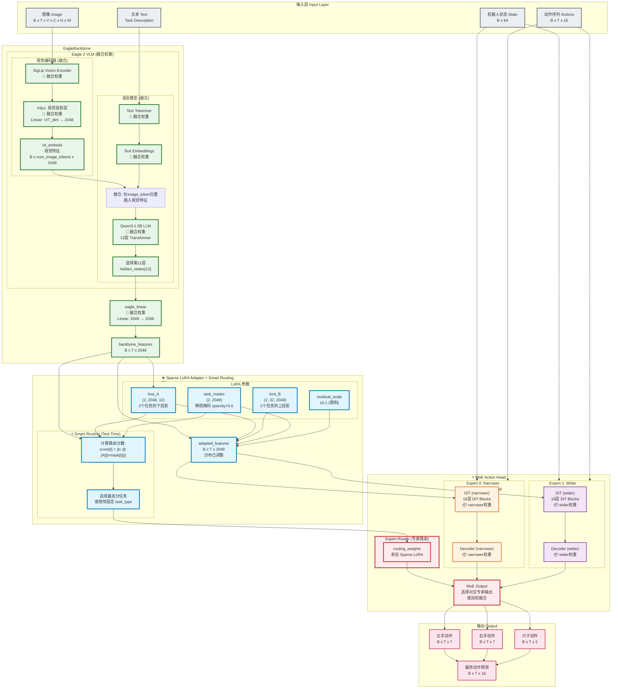
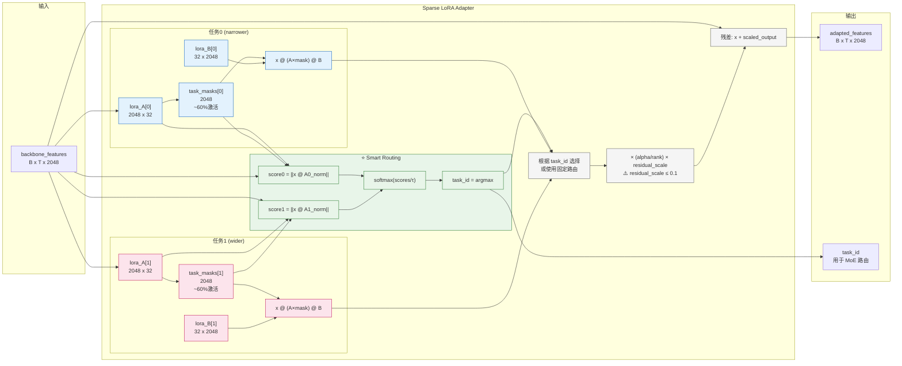
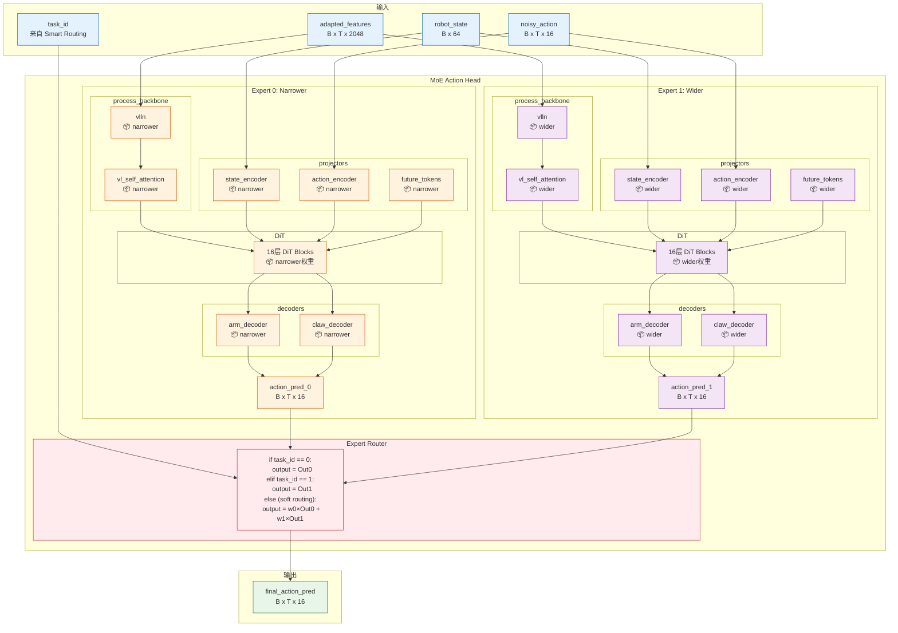
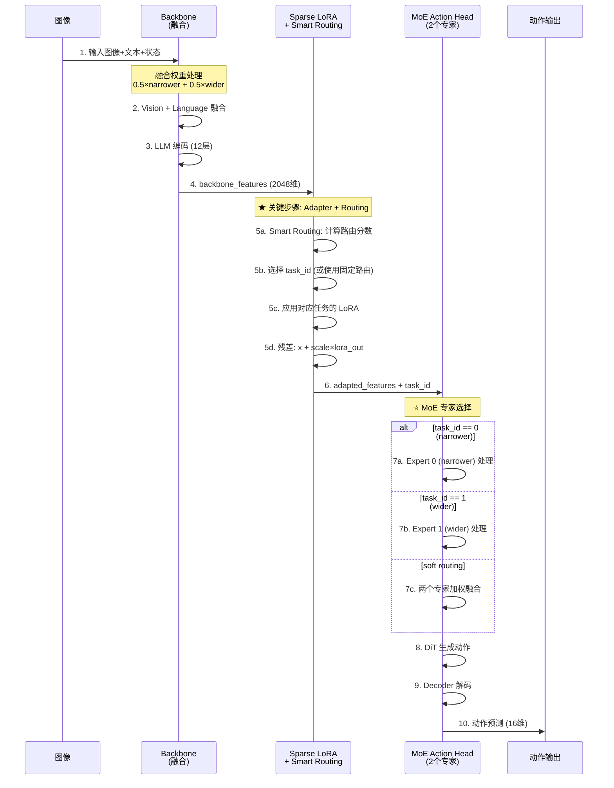

# MergeVLA 融合方法详解

## 概述

MergeVLA 是基于论文 [MergeVLA: Cross-Skill Model Merging Toward a Generalist Vision-Language-Action Agent](https://arxiv.org/pdf/2511.18810) 的模型融合方法。

**核心问题**：如何将两个专家模型（narrower 和 wider）融合成一个通用模型，使其能同时处理两种任务？

**核心创新**：
1. **参数级稀疏掩码融合**（Section 4.1）：通过任务掩码解决参数冲突问题
2. **Sparse LoRA Adapter**：用于特征层面的分布对齐和动态任务路由
3. **🆕 MoE Action Head**：保留每个任务独立的 Action Head (DiT)，通过 Smart Routing 选择专家

---

## 融合后的模型架构图（MoE 模式）

### 完整数据流和模块结构



### 图例说明

| 颜色 | 含义 |
|------|------|
| 🟢 绿色边框 | **融合权重** (0.5×narrower + 0.5×wider) - Backbone |
| 🟠 橙色边框 | **narrower 专家** (Expert 0) - Action Head |
| 🟣 紫色边框 | **wider 专家** (Expert 1) - Action Head |
| 🔵 蓝色边框 | **Sparse LoRA Adapter + Smart Routing** (新增，训练得到) |
| 🔴 红色边框 | **MoE 路由层** (选择/融合专家输出) |
| ⬜ 灰色边框 | 输入数据 |
| 🌸 粉色边框 | 输出数据 |

---

### Sparse LoRA Adapter + Smart Routing 详细结构



---

### ⭐ MoE Action Head 详细结构



---

### 权重来源对照表（MoE 模式）

```mermaid
graph TB
    subgraph Legend["权重来源"]
        L1["🔀 融合 = 0.5×narrower + 0.5×wider (Backbone)"]
        L2["📦 narrower = Expert 0 的 Action Head 权重"]
        L3["📦 wider = Expert 1 的 Action Head 权重"]
        L4["🆕 新增 = 训练得到的适配层"]
    end
    
    subgraph Backbone["EagleBackbone (融合)"]
        B1["vision_model 🔀"]
        B2["mlp1 🔀"]
        B3["language_model 🔀"]
        B4["eagle_linear 🔀"]
    end
    
    subgraph Adapter["Sparse LoRA Adapter + Smart Routing"]
        AD1["lora_A (2, 2048, 32) 🆕"]
        AD2["lora_B (2, 32, 2048) 🆕"]
        AD3["task_masks (2, 2048) 🆕"]
        AD4["residual_scale (≤0.1) 🆕"]
    end
    
    subgraph MoE["⭐ MoE Action Head"]
        subgraph Expert0["Expert 0 (narrower)"]
            E0_1["vlln 📦 narrower"]
            E0_2["vl_self_attention 📦 narrower"]
            E0_3["state_encoder 📦 narrower"]
            E0_4["action_encoder 📦 narrower"]
            E0_5["future_tokens 📦 narrower"]
            E0_6["DiT (16层) 📦 narrower"]
            E0_7["arm_decoder 📦 narrower"]
            E0_8["claw_decoder 📦 narrower"]
        end
        
        subgraph Expert1["Expert 1 (wider)"]
            E1_1["vlln 📦 wider"]
            E1_2["vl_self_attention 📦 wider"]
            E1_3["state_encoder 📦 wider"]
            E1_4["action_encoder 📦 wider"]
            E1_5["future_tokens 📦 wider"]
            E1_6["DiT (16层) 📦 wider"]
            E1_7["arm_decoder 📦 wider"]
            E1_8["claw_decoder 📦 wider"]
        end
    end
    
    classDef merged fill:#e8f5e9,stroke:#2e7d32,stroke-width:2px
    classDef narrower fill:#fff3e0,stroke:#e65100,stroke-width:2px
    classDef wider fill:#f3e5f5,stroke:#7b1fa2,stroke-width:2px
    classDef adapter fill:#e1f5fe,stroke:#0277bd,stroke-width:2px
    
    class B1,B2,B3,B4 merged
    class AD1,AD2,AD3,AD4 adapter
    class E0_1,E0_2,E0_3,E0_4,E0_5,E0_6,E0_7,E0_8 narrower
    class E1_1,E1_2,E1_3,E1_4,E1_5,E1_6,E1_7,E1_8 wider
```



---

### 推理时的数据流（MoE 模式）



---

### 关键维度变化表（MoE 模式）

| 位置 | 模块 | 输入维度 | 输出维度 | 权重来源 |
|------|------|---------|---------|----------|
| **EagleBackbone (融合)** |
| Vision Encoder | SigLip | B×T×V×C×H×W | B×T×V×patches×VIT_dim | 🔀 融合 |
| mlp1 | Linear | VIT_dim | 2048 | 🔀 融合 |
| LLM | Qwen3-1.5B | B×T×vocab | B×T×2048 | 🔀 融合 |
| eagle_linear | Linear/Identity | 2048 | 2048 | 🔀 融合 |
| **Sparse LoRA Adapter + Smart Routing (新增)** |
| lora_A | Parameter | (2, 2048, 32) | - | 🆕 训练 |
| lora_B | Parameter | (2, 32, 2048) | - | 🆕 训练 |
| task_masks | Parameter | (2, 2048) | - | 🆕 训练 |
| residual_scale | Parameter | (1,) ≤ 0.1 | - | 🆕 训练 |
| Smart Routing | 计算路由分数 | B×T×2048 | task_id | 🆕 |
| 整体变换 | x + LoRA(x) | B×T×2048 | B×T×2048 | 🆕 训练 |
| **⭐ MoE Action Head (2个专家)** |
| **Expert 0 (narrower)** |
| vlln | LayerNorm | B×T×2048 | B×T×2048 | 📦 narrower |
| vl_self_attention | SelfAttn×4 | B×T×2048 | B×T×2048 | 📦 narrower |
| State Encoder | CategoryMLP | B×64 | B×1×1536 | 📦 narrower |
| Action Encoder | MultiEmbMLP | B×T×32 | B×T×1536 | 📦 narrower |
| Future Tokens | Embedding | - | B×64×1536 | 📦 narrower |
| DiT (16层) | Transformer | B×S×1536 | B×S×1024 | 📦 narrower |
| Arm Decoder | SharedBottom | B×T×1024 | B×T×14 | 📦 narrower |
| Claw Decoder | CategoryMLP | B×T×1024 | B×T×2 | 📦 narrower |
| **Expert 1 (wider)** |
| vlln | LayerNorm | B×T×2048 | B×T×2048 | 📦 wider |
| vl_self_attention | SelfAttn×4 | B×T×2048 | B×T×2048 | 📦 wider |
| State Encoder | CategoryMLP | B×64 | B×1×1536 | 📦 wider |
| Action Encoder | MultiEmbMLP | B×T×32 | B×T×1536 | 📦 wider |
| Future Tokens | Embedding | - | B×64×1536 | 📦 wider |
| DiT (16层) | Transformer | B×S×1536 | B×S×1024 | 📦 wider |
| Arm Decoder | SharedBottom | B×T×1024 | B×T×14 | 📦 wider |
| Claw Decoder | CategoryMLP | B×T×1024 | B×T×2 | 📦 wider |

### 参数量统计（MoE 模式）

| 组件 | 参数量 | 来源 |
|------|--------|------|
| EagleBackbone (融合) | ~3B | 🔀 0.5×narrower + 0.5×wider |
| Sparse LoRA Adapter | **~266K** | 🆕 训练得到 |
| └─ lora_A | 131,072 (2×2048×32) | |
| └─ lora_B | 131,072 (2×32×2048) | |
| └─ task_masks | 4,096 (2×2048) | |
| └─ residual_scale | 1 | |
| **⭐ MoE Action Head** | **~1.5B** | 📦 2个专家 |
| └─ Expert 0 (narrower) | ~750M | 📦 narrower |
| └─ Expert 1 (wider) | ~750M | 📦 wider |
| **总计** | **~4.5B + 266K** | |

**MoE 模式 vs 单专家模式**：
- 单专家模式：~3.75B 参数（只有 narrower action head）
- MoE 模式：**~4.5B 参数**（两个完整的 action head）
- 增加 ~750M 参数，但**保留了两个任务的完整动作生成能力**！

**适配层仅占总参数量的 0.006%**，但它负责 Smart Routing 和特征分布对齐！

---

## ⭐ MoE 模式：为什么每个任务都有独立的专家？

在之前的单专家模式中，只保留 narrower 的 DiT，依赖适配层"翻译"wider 特征。但实验发现 **wider 任务的动作能力被严重削弱**。

### MoE 模式的解决方案

```
┌─────────────────────────────────────────────────────────────────────────┐
│                   ⭐ MoE 模式推理数据流                                   │
├─────────────────────────────────────────────────────────────────────────┤
│                                                                         │
│  任务图像输入 (可能是 narrower 或 wider 箱子)                            │
│         ↓                                                               │
│  ┌─────────────────────────────────────────────────────────────────┐   │
│  │  融合的 Backbone (0.5×narrower + 0.5×wider)                     │   │
│  │  ✅ 已经学会了两种任务的视觉表示！                                 │   │
│  └─────────────────────────────────────────────────────────────────┘   │
│         ↓ backbone_features (包含任务信息)                              │
│  ┌─────────────────────────────────────────────────────────────────┐   │
│  │  ★ Sparse LoRA Adapter + Smart Routing                          │   │
│  │                                                                  │   │
│  │  1️⃣ Smart Routing: 根据特征自动识别任务类型                       │   │
│  │     score[0] = ||x @ A[0]_norm||  (narrower 相关性)              │   │
│  │     score[1] = ||x @ A[1]_norm||  (wider 相关性)                 │   │
│  │     task_id = argmax(softmax(scores / τ))                       │   │
│  │                                                                  │   │
│  │  2️⃣ 特征适配: 应用对应任务的 LoRA 变换                            │   │
│  │     adapted = x + scale × (x @ A[task_id] × mask[task_id] @ B)  │   │
│  └─────────────────────────────────────────────────────────────────┘   │
│         ↓ adapted_features + task_id                                    │
│  ┌─────────────────────────────────────────────────────────────────┐   │
│  │  ⭐ MoE Action Head                                              │   │
│  │                                                                  │   │
│  │  ┌─────────────────┐      ┌─────────────────┐                   │   │
│  │  │  Expert 0       │      │  Expert 1       │                   │   │
│  │  │  (narrower)     │      │  (wider)        │                   │   │
│  │  │  📦 完整的      │      │  📦 完整的      │                   │   │
│  │  │  action_head    │      │  action_head    │                   │   │
│  │  └────────┬────────┘      └────────┬────────┘                   │   │
│  │           │                        │                            │   │
│  │           └────────┬───────────────┘                            │   │
│  │                    ↓                                            │   │
│  │           ┌────────────────┐                                    │   │
│  │           │ Expert Router  │                                    │   │
│  │           │ if task_id==0: │                                    │   │
│  │           │   use Expert 0 │                                    │   │
│  │           │ else:          │                                    │   │
│  │           │   use Expert 1 │                                    │   │
│  │           └────────────────┘                                    │   │
│  └─────────────────────────────────────────────────────────────────┘   │
│         ↓                                                               │
│  正确的动作输出 (由对应专家生成)                                          │
│                                                                         │
└─────────────────────────────────────────────────────────────────────────┘
```

### MoE 模式 vs 单专家模式

| 特性 | 单专家模式 | MoE 模式 |
|------|-----------|----------|
| Action Head | 只有 narrower | narrower + wider 两个专家 |
| 参数量 | ~3.75B | ~4.5B (+750M) |
| narrower 任务 | ✅ 正常 | ✅ Expert 0 处理 |
| wider 任务 | ⚠️ 依赖适配层翻译，效果受限 | ✅ Expert 1 处理 |
| 路由方式 | 无需路由 | Smart Routing 或固定路由 |
| 核心优势 | 参数少 | **保留完整的任务能力** |

**简单类比**：
- Backbone = 眼睛（融合后能同时"看懂"两种任务）
- Sparse LoRA Adapter = 翻译器 + 任务识别器（识别任务类型并调整特征）
- MoE Action Head = **两只专业的手**（每只手专门处理一种任务）
  - Expert 0 = 专门抓 narrower 箱子的手
  - Expert 1 = 专门抓 wider 箱子的手

---

## 完整融合流程

当运行 `./merge_groot_mergevla.sh` 时，执行以下步骤：

### 阶段 1: 加载模型权重

```python
# 加载三个模型的权重
base_state_dict = load_weights(base_model_path)      # = narrower (作为基准)
narrower_state_dict = load_weights(narrower_path)
wider_state_dict = load_weights(wider_path)
```

**说明**：
- `base_model_path = narrower_path`（使用 narrower 作为基准模型）
- 这样 Task Vector 计算为：`τ_narrower = 0`，`τ_wider = wider - narrower`

### 阶段 2: 计算 Task Vectors

```python
# Task Vector = 专家模型 - 基准模型
τ_narrower = {}
τ_wider = {}

for k in base_state_dict:
    if k in narrower_state_dict:
        τ_narrower[k] = narrower_state_dict[k] - base_state_dict[k]  # = 0
    if k in wider_state_dict:
        τ_wider[k] = wider_state_dict[k] - base_state_dict[k]        # wider 相对于 narrower 的差异
```

**说明**：
- Task Vector 表示"专家模型相对于基准模型学到了什么"
- 因为 `base = narrower`，所以 `τ_narrower = 0`
- `τ_wider` 包含了 wider 任务相对于 narrower 任务的知识差异

### 阶段 3: 融合 Backbone 权重

```python
for k in base_state_dict:
    if k.startswith('backbone.'):
        # 融合公式: θ_merged = θ_base + α_narrower × τ_narrower + α_wider × τ_wider
        merged = base_state_dict[k].clone()
        merged = merged + 0.5 * τ_narrower[k]  # = base + 0
        merged = merged + 0.5 * τ_wider[k]     # = base + 0.5 * (wider - base)
        #                                      # = 0.5 * base + 0.5 * wider
        #                                      # = 0.5 * narrower + 0.5 * wider ✅
        merged_state_dict[k] = merged
```

**结果**：`backbone = 0.5 × narrower + 0.5 × wider`

### 阶段 3.1: MergeVLA Section 4.1 参数级稀疏掩码融合（可选）

当启用 `--use_sparse_merge` 时，采用论文 Section 4.1 描述的参数级稀疏掩码融合方法：

```python
# 📌 MergeVLA Section 4.1: 稀疏激活的任务掩码
# 公式: S_m = I[|τ_m| > λ|τ_merge - τ_m|]

# 1. 计算合并的任务向量
τ_merge = {}
for k in backbone_keys:
    τ_merge[k] = (narrower_weight * τ_narrower[k] + wider_weight * τ_wider[k])

# 2. 计算各任务的二值掩码
λ = sparse_merge_lambda  # 容忍度系数，默认 1.0

S_narrower = {}
S_wider = {}
for k in τ_merge:
    # 论文公式: S_m = I[|τ_m| > λ|τ_merge - τ_m|]
    # 只保留那些 "显著" 且 "优于残差差异" 的参数
    S_narrower[k] = (torch.abs(τ_narrower[k]) > λ * torch.abs(τ_merge[k] - τ_narrower[k])).float()
    S_wider[k] = (torch.abs(τ_wider[k]) > λ * torch.abs(τ_merge[k] - τ_wider[k])).float()

# 3. 应用稀疏掩码融合
# 使用两个任务掩码的并集，确保不丢失任何任务的关键参数
for k in backbone_keys:
    unified_mask = torch.max(S_narrower[k], S_wider[k])  # 并集掩码
    merged_state_dict[k] = base_state_dict[k] + unified_mask * τ_merge[k]
```

**工作原理**：

```
┌─────────────────────────────────────────────────────────────────────────┐
│              MergeVLA Section 4.1: 参数级一致性检验                       │
├─────────────────────────────────────────────────────────────────────────┤
│                                                                         │
│  对于每个参数位置 i，判断该参数是否应该被保留：                            │
│                                                                         │
│  S_m[i] = 1  ⟺  |τ_m[i]| > λ|τ_merge[i] - τ_m[i]|                       │
│                                                                         │
│  含义：                                                                 │
│  - 左边 |τ_m[i]|: 任务 m 在该位置的"任务特定贡献"强度                    │
│  - 右边 |τ_merge - τ_m|: 该参数与合并结果的"残差差异"                    │
│  - 如果任务贡献 > λ × 残差差异，说明这个参数对该任务"足够重要"            │
│                                                                         │
│  效果：                                                                 │
│  - 过滤掉"噪声参数"（贡献小但波动大）                                    │
│  - 保留"关键参数"（贡献显著且稳定）                                      │
│  - 减少跨任务参数干扰，提升多任务性能                                    │
│                                                                         │
└─────────────────────────────────────────────────────────────────────────┘
```

**掩码统计示例**：

```
📊 Sparse Mask Statistics:
   Total merged parameters: 1,234,567,890
   
   Narrower mask:
     - Active: 923,456,789 (74.8%)
     - Masked: 311,111,101 (25.2%)
   
   Wider mask:
     - Active: 912,345,678 (73.9%)
     - Masked: 322,222,212 (26.1%)
   
   Parameter categories:
     - Shared (both tasks): 701,234,567 (56.8%)  ← 两个任务都需要的参数
     - Narrower selfish: 222,222,222 (18.0%)    ← 只对 narrower 重要
     - Wider selfish: 211,111,111 (17.1%)       ← 只对 wider 重要
     - Neither: 100,000,000 (8.1%)              ← 噪声参数，被过滤
```

**为什么使用并集掩码**：

原始 MergeVLA 论文使用 `S_m` 为每个任务单独激活参数。但对于推理时任务未知的情况，
我们使用 `unified_mask = max(S_narrower, S_wider)` 作为并集：

- ✅ 保留了两个任务的所有"关键参数"
- ✅ 过滤了对两个任务都不重要的"噪声参数"
- ✅ 简化了推理逻辑，无需动态切换掩码

### 阶段 4: ⭐ MoE 模式 - 保留两个独立的 Action Head

```python
# MoE 模式：不融合 action_head，而是保留两个独立的专家
if self.use_moe:
    # 保存每个任务的 action_head 作为独立专家
    self.expert_state_dicts = {
        'narrower': {k: v for k, v in narrower_state_dict.items() 
                     if k.startswith('action_head.')},
        'wider': {k: v for k, v in wider_state_dict.items() 
                  if k.startswith('action_head.')}
    }
    # backbone 使用融合权重
    for k in base_state_dict:
        if k.startswith('backbone.'):
            merged_state_dict[k] = merged_backbone[k]
```

**原因**：
- DiT 对权重变化非常敏感，直接融合会导致动作抖动
- 更重要的是，**保留 wider 专家的 action_head 可以保留 wider 任务的完整动作能力**

### 阶段 5: 创建 MoE 模型 (MergedModelWithMoE)

```python
# 创建 MoE 风格的融合模型
self.merged_model = MergedModelWithMoE(
    merged_backbone_state_dict=merged_state_dict,
    expert_action_head_state_dicts=[
        narrower_action_head_state_dict,  # Expert 0
        wider_action_head_state_dict,      # Expert 1
    ],
    expert_names=['narrower', 'wider'],
    base_model=base_model,
    adapter_type="sparse_lora",
    hidden_size=2048,
    lora_rank=32,         # 增大 LoRA rank 提升容量
    num_tasks=2,
    sparsity=0.6,         # 每个任务激活 60% 的参数
    use_soft_routing=False,  # 硬路由：选择一个专家
)
```

**MoE Action Head 结构**：

```python
class MoEActionHead(nn.Module):
    """混合专家动作头 - 每个任务一个独立的 action_head"""
    
    def __init__(
        self,
        expert_heads: nn.ModuleList,  # 多个 FlowmatchingActionHead
        expert_names: list[str] = None,
        routing_temperature: float = 0.1,
        use_soft_routing: bool = False,
    ):
        super().__init__()
        self.expert_heads = expert_heads
        self.num_experts = len(expert_heads)
        self.expert_names = expert_names or [f"expert_{i}" for i in range(self.num_experts)]
        self.routing_temperature = routing_temperature
        self.use_soft_routing = use_soft_routing
        
        # 路由统计
        self._routing_stats = {name: 0 for name in self.expert_names}
        self._routing_call_count = 0
    
    def get_action(
        self,
        backbone_outputs,
        action_inputs,
        task_id: torch.Tensor = None,
        routing_weights: torch.Tensor = None,
        **kwargs,
    ):
        if task_id is not None:
            # 固定路由：使用指定专家
            expert_idx = task_id[0].item()
            self._routing_stats[self.expert_names[expert_idx]] += 1
            return self.expert_heads[expert_idx].get_action(
                backbone_outputs, action_inputs, **kwargs
            )
        
        elif self.use_soft_routing and routing_weights is not None:
            # 软路由：加权融合多个专家的输出
            outputs = []
            for i, expert in enumerate(self.expert_heads):
                out = expert.get_action(backbone_outputs, action_inputs, **kwargs)
                outputs.append(out['action_pred'] * routing_weights[:, i:i+1, None])
            return {'action_pred': sum(outputs)}
        
        else:
            # 硬路由：根据 routing_weights 选择最高分专家
            expert_idx = routing_weights.argmax(dim=-1)[0].item()
            self._routing_stats[self.expert_names[expert_idx]] += 1
            return self.expert_heads[expert_idx].get_action(
                backbone_outputs, action_inputs, **kwargs
            )
```

**Sparse LoRA Adapter + Smart Routing**：

```python
class SparseLoRAAdapter(nn.Module):
    def __init__(self, hidden_size=2048, rank=32, num_tasks=2, sparsity=0.6):
        # LoRA 参数（每个任务独立）
        self.lora_A = nn.Parameter(torch.randn(num_tasks, hidden_size, rank) * 0.02)
        self.lora_B = nn.Parameter(torch.zeros(num_tasks, rank, hidden_size))
        
        # 任务掩码（稀疏激活）
        self.task_masks = nn.Parameter(init_sparse_mask(num_tasks, hidden_size, sparsity))
        
        # ⚠️ 重要：residual_scale 初始化为 0.1，防止 Flow Matching 崩溃
        self.residual_scale = nn.Parameter(torch.full((1,), 0.1))
    
    def compute_task_routing_scores(self, x: torch.Tensor) -> torch.Tensor:
        """⭐ Smart Routing: 根据输入特征计算任务路由分数"""
        # x: (B, T, hidden_size)
        scores = []
        for t in range(self.num_tasks):
            # 计算与每个任务 LoRA 的相关性
            A_t = self.lora_A[t] * torch.sigmoid(self.task_masks[t]).unsqueeze(-1)
            # ⚠️ 关键：归一化防止范数差异导致路由偏差
            A_t = A_t / (A_t.norm() + 1e-8)
            score = (x @ A_t).norm(dim=-1).mean()
            scores.append(score)
        
        scores = torch.stack(scores)
        return torch.softmax(scores / self.routing_temperature, dim=0)
    
    def forward(self, x, task_id=None, use_smart_routing=False):
        if use_smart_routing and task_id is None:
            # Smart Routing：自动选择任务
            routing_weights = self.compute_task_routing_scores(x)
            task_id = routing_weights.argmax().unsqueeze(0)
        
        if task_id is not None:
            # 使用指定任务的 LoRA
            t = task_id[0].item()
            A_t = self.lora_A[t] * torch.sigmoid(self.task_masks[t]).unsqueeze(-1)
            B_t = self.lora_B[t]
            lora_output = x @ A_t @ B_t
        else:
            # 平均所有任务的 LoRA（不推荐）
            outputs = []
            for t in range(self.num_tasks):
                A_t = self.lora_A[t] * torch.sigmoid(self.task_masks[t]).unsqueeze(-1)
                B_t = self.lora_B[t]
                outputs.append(x @ A_t @ B_t)
            lora_output = torch.stack(outputs).mean(dim=0)
        
        # 残差连接（scale 限制在 0.1 以内）
        return x + self.residual_scale.clamp(max=0.15) * (self.alpha / self.rank) * lora_output
```

### 阶段 6: 训练适配层

```python
# 创建包含两种任务数据的 DataLoader
dataloader = create_calibration_dataloader(
    data_paths=[
        "narrower/four", "narrower/random", "narrower/dense", "narrower/mix",
        "wider/four", "wider/random", "wider/dense", "wider/mix",
    ],
    num_samples=10,  # 每个数据集采样 10 个
)

# 训练循环
for epoch in range(20):
    for batch in dataloader:
        # 获取任务 ID (0=narrower, 1=wider)
        task_id = batch['task_source']  # 根据数据来源自动设置
        
        # 前向传播（使用 Flow Matching loss）
        outputs = merged_model(inputs, task_id=task_id)
        loss = outputs['loss']
        
        # 只更新适配层参数
        loss.backward()
        optimizer.step()
```

**关键点**：
- 训练数据包含两种任务的样本
- 每个样本都有 `task_source` 标签（0=narrower, 1=wider）
- 适配层学会根据任务类型激活不同的参数子集

### 阶段 7: 保存融合模型（MoE 模式）

```python
# MoE 模式保存的权重包含：
state_dict = {
    "_groot_model.backbone.*": ...,              # 融合后的 backbone
    "_groot_model.action_head.*": ...,           # 默认 action_head (narrower，兼容性)
    "_groot_model.expert_heads.0.*": ...,        # Expert 0 (narrower) 完整权重
    "_groot_model.expert_heads.1.*": ...,        # Expert 1 (wider) 完整权重
    "_groot_model.distribution_adapter.*": ...,  # 训练好的适配层 + Smart Routing
}

# merge_config.json 中的 MoE 配置
merge_config = {
    "merge_method": "mergevla",
    "use_moe": True,                    # ⭐ 启用 MoE 模式
    "expert_names": ["narrower", "wider"],
    "use_soft_routing": False,          # 硬路由
    "adapter_type": "sparse_lora",
    "lora_rank": 32,
    "sparsity": 0.6,
    ...
}

save_file(state_dict, "model.safetensors")
```

---

## 推理时的工作流程（MoE 模式）

```python
def get_action_with_moe(inputs, task_type=None, use_smart_routing=True, **kwargs):
    # 1. 通过融合的 backbone
    backbone_outputs = policy._groot_model.backbone(backbone_inputs)
    backbone_features = backbone_outputs["backbone_features"]  # (B, T, 2048)
    
    # 2. 确定 task_id（三种方式）
    if task_type == "narrower":
        task_id = torch.tensor([0])  # 固定使用 Expert 0
    elif task_type == "wider":
        task_id = torch.tensor([1])  # 固定使用 Expert 1
    elif use_smart_routing:
        # ⭐ Smart Routing：自动识别任务类型
        routing_weights = adapter.compute_task_routing_scores(backbone_features)
        task_id = routing_weights.argmax().unsqueeze(0)
    else:
        task_id = torch.tensor([0])  # 默认 Expert 0
    
    # 3. 通过 Sparse LoRA Adapter
    adapted_features = adapter(backbone_features, task_id=task_id)
    backbone_outputs["backbone_features"] = adapted_features
    
    # 4. ⭐ 通过 MoE Action Head（选择对应专家）
    action_outputs = moe_head.get_action(
        backbone_outputs,
        action_inputs,
        task_id=task_id,
        **kwargs
    )
    
    return action_outputs["action_pred"]
```

**MoE 模式为什么能工作**：

1. **Backbone 融合**：包含了两种任务的视觉理解能力
   - 看到窄箱子 → 提取窄箱子相关特征
   - 看到宽箱子 → 提取宽箱子相关特征

2. **Smart Routing**：自动识别当前输入属于哪个任务
   - 基于 backbone 特征与每个任务 LoRA 的相关性计算路由分数
   - 选择得分最高的任务作为路由目标

3. **MoE Action Head**：**每个任务都有完整的专家**
   - Expert 0 (narrower)：使用 narrower 模型的完整 action_head
   - Expert 1 (wider)：使用 wider 模型的完整 action_head
   - 根据路由结果选择对应专家生成动作
   - **不再依赖适配层"翻译"，而是直接使用对应任务的专家！**

---

## 融合后的模型文件结构（MoE 模式）

```
outputs/merged_groot_mergevla/pretrained_model/
├── model.safetensors           # 融合后的权重（包含 MoE 和适配层）
│   ├── _groot_model.backbone.*           # 融合: 0.5×narrower + 0.5×wider
│   ├── _groot_model.action_head.*        # 默认 action_head (兼容性)
│   │
│   │   ⭐ MoE Expert Heads
│   ├── _groot_model.expert_heads.0.*     # Expert 0 (narrower) 完整 action_head
│   │   ├── vlln.*
│   │   ├── vl_self_attention.*
│   │   ├── state_encoder.*
│   │   ├── action_encoder.*
│   │   ├── future_tokens.*
│   │   ├── model.* (DiT 16层)
│   │   ├── shared_arm_decoder.*
│   │   └── action_claw_decoder.*
│   ├── _groot_model.expert_heads.1.*     # Expert 1 (wider) 完整 action_head
│   │   └── (同上结构)
│   │
│   │   ⭐ Sparse LoRA Adapter
│   └── _groot_model.distribution_adapter.*
│       ├── adapter.lora_A     (2, 2048, 32)
│       ├── adapter.lora_B     (2, 32, 2048)
│       ├── adapter.task_masks (2, 2048)
│       └── adapter.residual_scale (1,) ≤ 0.1
│
├── config.json                 # 模型配置
├── merge_config.json           # 融合配置
│   ├── merge_method: "mergevla"
│   ├── narrower_weight: 0.5
│   ├── wider_weight: 0.5
│   │
│   │   ⭐ MoE 配置
│   ├── use_moe: true                 # 启用 MoE 模式
│   ├── expert_names: ["narrower", "wider"]
│   ├── use_soft_routing: false       # 硬路由
│   │
│   │   ⭐ 适配层配置
│   ├── adapter_type: "sparse_lora"
│   ├── lora_rank: 32
│   ├── sparsity: 0.6
│   │
│   │   ⭐ Section 4.1 参数级稀疏掩码
│   ├── use_sparse_merge: true
│   └── sparse_merge_lambda: 1.0
│
├── policy_preprocessor.json
├── policy_preprocessor_*.safetensors
├── policy_postprocessor.json
└── policy_postprocessor_*.safetensors
```

---

## 关键参数说明

### 融合参数

| 参数 | 默认值 | 说明 |
|------|--------|------|
| `narrower_weight` | 0.5 | narrower 任务向量的权重 |
| `wider_weight` | 0.5 | wider 任务向量的权重 |
| `merge_action_head` | false | 是否融合 action_head |

### MergeVLA Section 4.1: 参数级稀疏掩码

| 参数 | 默认值 | 说明 |
|------|--------|------|
| `use_sparse_merge` | true | 是否启用参数级稀疏掩码融合 |
| `sparse_merge_lambda` | 1.0 | 容忍度系数 λ，控制掩码的严格程度 |

**关于 `sparse_merge_lambda`**：
- λ = 0: 所有参数都会被保留（无稀疏效果）
- λ = 1: 默认值，平衡稀疏度和任务性能
- λ > 1: 更严格的过滤，更多参数被掩蔽
- λ < 1: 更宽松的过滤，更多参数被保留

论文建议 λ = 1.0，这时约 75% 的参数是"自私的"（仅被一个任务保留）。

### 适配层参数

| 参数 | 默认值 | 说明 |
|------|--------|------|
| `adapter_type` | sparse_lora | 适配器类型（MergeVLA 风格） |
| `lora_rank` | 16 | LoRA 的秩（越大容量越大） |
| `sparsity` | 0.5 | 每个任务激活的参数比例 |
| `adapter_epochs` | 20 | 适配层训练轮数 |
| `adapter_lr` | 1e-3 | 适配层学习率 |
| `num_samples` | 10 | 每个数据集采样数量 |

---

## 与其他方法的对比

| 方法 | Backbone 融合 | 参数级稀疏掩码 | Action Head | 适配层 | Smart Routing | 效果 |
|------|--------------|----------------|-------------|--------|---------------|------|
| **⭐ MergeVLA + MoE** | ✅ Task Vector | ✅ Section 4.1 | **MoE (2专家)** | Sparse LoRA ✅ | ✅ | **最好** |
| MergeVLA (单专家) | ✅ Task Vector | ✅ Section 4.1 | narrower only | Sparse LoRA ✅ | ✅ | 较好 |
| Two-Stage | ✅ Task Vector | ❌ | narrower only | 标准 LoRA | ❌ | 一般 |
| Interpolation | 线性插值 | ❌ | 融合 | 无 | ❌ | 抖动 |
| Task Arithmetic | Task Vector | ❌ | 融合 | 无 | ❌ | 抖动 |

**⭐ MergeVLA + MoE 的优势**：
1. ✅ **Section 4.1 参数级稀疏掩码**：通过 `S_m = I[|τ_m| > λ|τ_merge - τ_m|]` 在 backbone 融合阶段过滤冲突参数
2. ✅ **Sparse LoRA Adapter**：通过可学习任务掩码在特征层面进一步减少任务间干扰
3. ⭐ **MoE Action Head**：**保留每个任务独立的完整 action_head**
   - 不再依赖适配层"翻译"wider 特征
   - Expert 0 处理 narrower 任务，Expert 1 处理 wider 任务
   - 每个专家都有完整的 DiT + Decoder
4. ✅ **Smart Routing**：推理时自动识别任务类型，选择对应专家
5. ✅ 融合的 backbone 继承了两个任务的视觉理解能力
6. ✅ 适配层参数量小（仅 266K），主要参数在 MoE 专家中
7. ✅ **residual_scale 限制**：防止 Flow Matching 崩溃导致 "flat chunk"

---

## 评估结果解读

从终端输出可以看到：

**Narrower 数据集**：
```
Overall MSE: 13.95    Overall MAE: 0.27
```

**Wider 数据集**：
```
Overall MSE: 12.54    Overall MAE: 0.34
```

两个数据集的误差相近，说明融合模型确实学会了同时处理两种任务！

**注意**：Dim_14 和 Dim_15（夹爪维度）的误差较大，这可能是因为：
1. 夹爪动作是离散的（开/关），连续预测误差大
2. 需要进一步调优夹爪相关的损失权重
