# RTC 数据流详细流程图

```mermaid
graph TB
    %% ========== 主线程初始化 ==========
    Start([主程序启动 demo_cli]) --> InitLog[初始化日志系统]
    InitLog --> InitSignal[设置信号处理器 ProcessSignalHandler]
    InitSignal --> CreateEnv[创建 GrabBoxMpcEnv 环境]
    CreateEnv --> CreateRobot[创建 RobotSDK]
    CreateRobot --> InitFakeObs[初始化 FakeObsStream<br/>从数据集读取观测]
    
    InitFakeObs --> LoadPolicy[加载 Policy<br/>GrootPolicy.from_pretrained]
    LoadPolicy --> InitRTC[初始化 RTC Processor<br/>policy.init_rtc_processor]
    InitRTC --> CreateQueue[创建 ActionQueue<br/>cfg.rtc]
    CreateQueue --> InitArm[初始化手臂位置<br/>robot_sdk.control_arm_joint_positions]
    
    InitArm --> StartThreads[启动两个线程]
    
    %% ========== Get Actions 线程 ==========
    StartThreads --> GetActionsThread[Get Actions 线程启动]
    
    GetActionsThread --> CheckQueueSize{检查队列大小<br/>qsize <= threshold?}
    CheckQueueSize -->|队列满| SleepWait[睡眠 0.01s<br/>防止忙等待]
    SleepWait --> CheckQueueSize
    
    CheckQueueSize -->|队列不满| RecordTime[记录当前时间<br/>current_time = perf_counter]
    RecordTime --> GetActionIndex[获取动作索引<br/>action_index_before_inference]
    GetActionIndex --> GetLeftOver[获取上一块剩余动作<br/>action_queue.get_left_over<br/>返回 prev_chunk_left_over]
    
    GetLeftOver --> CalcDelay[计算推理延迟<br/>inference_delay = ceil<br/>latency / time_per_chunk]
    CalcDelay --> GetObs[从 FakeObsStream 获取观测<br/>obs_data = obs_stream.get_obs]
    GetObs --> SkipFrames[跳过10帧观测<br/>for _ in range 10]
    SkipFrames --> PreprocessObs[预处理观测<br/>构建 observation dict]
    
    PreprocessObs --> PreprocessState[处理 state<br/>torch.from_numpy]
    PreprocessState --> PreprocessImages[处理相机图像<br/>转换为 CHW 格式<br/>归一化到 0-1]
    PreprocessImages --> ApplyPreprocessor[应用 Preprocessor<br/>tokenization, normalization<br/>device placement]
    
    ApplyPreprocessor --> CallPolicy[调用 Policy.predict_action_chunk<br/>processed_observation<br/>inference_delay<br/>prev_chunk_left_over]
    
    %% ========== Policy 内部流程 ==========
    CallPolicy --> PolicyForward[Policy 内部处理]
    PolicyForward --> BuildInput[构建 GR00T 输入<br/>过滤 batch keys]
    BuildInput --> GrootGetAction[调用 _groot_model.get_action]
    
    GrootGetAction --> ActionHeadGetAction[FlowmatchingActionHead.get_action]
    ActionHeadGetAction --> InitNoise[初始化噪声<br/>x_t = randn B,T,action_dim]
    InitNoise --> DenoiseLoop[开始去噪循环<br/>num_steps 次迭代]
    
    DenoiseLoop --> CalcTime[计算时间步<br/>t_cont = t / num_steps<br/>t_discretized = int t_cont * buckets]
    CalcTime --> CheckRTC{RTC 启用?}
    
    CheckRTC -->|否| DirectDenoise[直接去噪<br/>denoise_step_partial_call x_t]
    CheckRTC -->|是| RTCDenoise[RTC 引导去噪<br/>rtc_processor.denoise_step]
    
    %% ========== RTC Inpainting 详细流程 ==========
    RTCDenoise --> CheckPrevChunk{prev_chunk_left_over<br/>是否存在?}
    CheckPrevChunk -->|否| ReturnVT[直接返回 v_t<br/>original_denoise_step_partial]
    CheckPrevChunk -->|是| CloneXT[克隆 x_t<br/>x_t.clone.detach]
    
    CloneXT --> AddBatchDim[添加 batch 维度<br/>如果维度不足]
    AddBatchDim --> PadPrevChunk[填充上一块动作<br/>如果长度不足则右填充0]
    PadPrevChunk --> GetPrefixWeights[计算前缀权重<br/>get_prefix_weights<br/>inference_delay, execution_horizon]
    
    GetPrefixWeights --> CalcWeights[根据调度类型计算权重<br/>ZEROS/ONES/LINEAR/EXP]
    CalcWeights --> EnableGrad[启用梯度计算<br/>torch.enable_grad]
    EnableGrad --> CallOriginalDenoise[调用原始去噪函数<br/>v_t = original_denoise_step_partial x_t]
    
    CallOriginalDenoise --> SetGrad[设置 x_t.requires_grad_ True]
    SetGrad --> PredictX1[预测下一步状态<br/>x1_t = x_t - time * v_t]
    PredictX1 --> CalcError[计算误差<br/>err = prev_chunk_left_over - x1_t<br/>err = err * weights]
    CalcError --> CalcCorrection[计算修正梯度<br/>correction = autograd.grad<br/>x1_t w.r.t x_t]
    
    CalcCorrection --> CalcGuidanceWeight[计算引导权重<br/>tau = 1 - time<br/>guidance_weight = f tau<br/>clamp by max_guidance_weight]
    CalcGuidanceWeight --> ApplyCorrection[应用修正<br/>result = v_t - guidance_weight * correction]
    ApplyCorrection --> TrackDebug[记录调试信息<br/>track time, x1_t, correction, err]
    TrackDebug --> ReturnGuidedVT[返回引导后的 v_t]
    
    ReturnGuidedVT --> EulerStep[欧拉步进<br/>x_t = x_t + dt * v_t]
    DirectDenoise --> EulerStep
    ReturnVT --> EulerStep
    
    EulerStep --> CheckMoreSteps{还有更多<br/>去噪步骤?}
    CheckMoreSteps -->|是| DenoiseLoop
    CheckMoreSteps -->|否| ExtractActions["提取最终动作<br/>actions_output = x_t切片提取actual_action_dim"]
    
    ExtractActions --> ReturnActions[返回动作预测<br/>BatchFeature action_pred]
    ReturnActions --> PolicyReturn[Policy 返回 actions<br/>shape: B, chunk_size, action_dim]
    
    %% ========== 后处理流程 ==========
    PolicyReturn --> PostProcessStart[开始后处理]
    PostProcessStart --> SqueezeBatch[去除 batch 维度<br/>original_actions = actions.squeeze 0]
    SqueezeBatch --> PostProcessLoop[遍历每个动作<br/>for i in range chunk_size]
    
    PostProcessLoop --> ExtractSingle["提取单个动作<br/>single_action = actions切片第i个动作"]
    ExtractSingle --> ApplyPostprocessor[应用 Postprocessor<br/>反归一化 unnormalize]
    ApplyPostprocessor --> StackActions[堆叠动作<br/>torch.stack processed_actions]
    
    StackActions --> CalcNewLatency[计算新延迟<br/>new_latency = perf_counter - current_time]
    CalcNewLatency --> CalcNewDelay[计算新延迟步数<br/>new_delay = ceil new_latency / time_per_chunk]
    CalcNewDelay --> UpdateTracker[更新延迟跟踪器<br/>latency_tracker.add new_latency]
    
    UpdateTracker --> ResampleChunk[重采样动作块<br/>resample_chunk_with_claw_hold]
    
    %% ========== 重采样详细流程 ==========
    ResampleChunk --> CheckPrevious{previous_action<br/>存在?}
    CheckPrevious -->|是| ConcatBridge[拼接桥接动作<br/>chunk_with_bridge = vstack<br/>previous_action, action_chunk]
    CheckPrevious -->|否| UseChunk[直接使用 action_chunk]
    
    ConcatBridge --> ResampleArm[重采样手臂动作<br/>线性插值 10Hz -> 100Hz<br/>resample_action_chunk]
    UseChunk --> ResampleArm
    
    ResampleArm --> CalcHoldIndices[计算保持索引<br/>searchsorted 找到对应<br/>原始时间步]
    CalcHoldIndices --> HoldClaw["零阶保持爪子动作<br/>resampled claw_dims切片 =<br/>source_array hold_indices对应claw_dims"]
    HoldClaw --> ConvertTensor[转换为 Tensor<br/>torch.from_numpy.to device]
    
    ConvertTensor --> SaveLastAction["保存最后执行的动作<br/>last_executed_action =<br/>resampled倒数第threshold个"]
    SaveLastAction --> MergeQueue[合并到队列<br/>action_queue.merge]
    
    %% ========== ActionQueue Merge 详细流程 ==========
    MergeQueue --> AcquireLock[获取锁<br/>with self.lock]
    AcquireLock --> CheckDelays[检查延迟<br/>_check_delays<br/>验证 real_delay]
    CheckDelays --> CheckRTCEnabled{RTC 启用?}
    
    CheckRTCEnabled -->|否| AppendMode[追加模式<br/>_append_actions_queue]
    CheckRTCEnabled -->|是| ReplaceMode[替换模式<br/>_replace_actions_queue]
    
    AppendMode --> RemoveConsumed["移除已消费动作<br/>queue = queue从last_index开始切片"]
    RemoveConsumed --> ConcatNew[拼接新动作<br/>queue = cat queue, new_actions]
    ConcatNew --> ResetIndex[重置索引<br/>last_index = 0]
    
    ReplaceMode --> SkipDelay["跳过延迟动作<br/>original_queue =<br/>original_actions从real_delay开始切片"]
    SkipDelay --> SkipDelayResampled["跳过重采样延迟<br/>queue = processed_actions从real_delay*10开始切片"]
    SkipDelayResampled --> LogShapes[记录形状信息<br/>logger.info shapes]
    LogShapes --> ResetIndexReplace[重置索引<br/>last_index = 0<br/>original_last_index = 0]
    
    ResetIndex --> ReleaseLock[释放锁]
    ResetIndexReplace --> ReleaseLock
    
    ReleaseLock --> LoopBack[回到检查队列大小]
    LoopBack --> CheckQueueSize
    
    %% ========== Actor Control 线程 ==========
    StartThreads --> ActorThread[Actor Control 线程启动]
    
    ActorThread --> CalcInterval[计算动作间隔<br/>action_interval = 1.0 / 100]
    CalcInterval --> ActorLoop[执行循环]
    
    ActorLoop --> RecordStartTime[记录开始时间<br/>start_time = perf_counter]
    RecordStartTime --> CheckQueueEmpty{队列为空?}
    
    CheckQueueEmpty -->|是| NoAction[action = None]
    CheckQueueEmpty -->|否| GetAction[从队列获取动作<br/>action = action_queue.get]
    
    GetAction --> UpdateIndex[更新索引<br/>if last_index % 10 == 0:<br/>original_last_index = last_index // 10]
    UpdateIndex --> CloneAction[克隆动作<br/>action.clone]
    
    CloneAction --> CheckAction{action<br/>存在?}
    NoAction --> CheckAction
    
    CheckAction -->|否| SleepActor[睡眠等待<br/>sleep max 0, interval - dt]
    CheckAction -->|是| MoveToCPU[移动到 CPU<br/>action.cpu]
    
    MoveToCPU --> CheckPose[检查是否需要控制姿态<br/>control_cmd_pose]
    CheckPose --> ExecAction[执行动作<br/>env.exec_actions<br/>control_arm, control_claw]
    ExecAction --> IncrementCount[增加计数<br/>action_count += 1]
    
    IncrementCount --> CalcDT[计算执行时间<br/>dt_s = perf_counter - start_time]
    CalcDT --> SleepActor
    
    SleepActor --> CheckShutdown{shutdown_event<br/>设置?}
    CheckShutdown -->|否| ActorLoop
    CheckShutdown -->|是| ActorShutdown[线程关闭<br/>记录总动作数]
    
    %% ========== 主线程监控 ==========
    StartThreads --> MainLoop[主线程监控循环]
    MainLoop --> CheckDuration{时间 < duration<br/>且未关闭?}
    CheckDuration -->|是| SleepMain[睡眠 5 秒]
    SleepMain --> LogQueueSize[记录队列大小<br/>logger.info qsize]
    LogQueueSize --> CheckDuration
    
    CheckDuration -->|否| SetShutdown[设置关闭事件<br/>shutdown_event.set]
    SetShutdown --> JoinThreads[等待线程结束<br/>get_actions_thread.join<br/>actor_thread.join]
    JoinThreads --> End([程序结束])
    
    %% ========== 样式定义 ==========
    classDef mainThread fill:#e1f5ff,stroke:#01579b,stroke-width:2px
    classDef getActionsThread fill:#fff3e0,stroke:#e65100,stroke-width:2px
    classDef actorThread fill:#f3e5f5,stroke:#4a148c,stroke-width:2px
    classDef rtcProcess fill:#e8f5e9,stroke:#1b5e20,stroke-width:3px
    classDef queueProcess fill:#fce4ec,stroke:#880e4f,stroke-width:2px
    classDef resampleProcess fill:#fff9c4,stroke:#f57f17,stroke-width:2px
    
    class Start,InitLog,InitSignal,CreateEnv,CreateRobot,InitFakeObs,LoadPolicy,InitRTC,CreateQueue,InitArm,StartThreads,MainLoop,CheckDuration,SleepMain,LogQueueSize,SetShutdown,JoinThreads,End mainThread
    class GetActionsThread,CheckQueueSize,SleepWait,RecordTime,GetActionIndex,GetLeftOver,CalcDelay,GetObs,SkipFrames,PreprocessObs,PreprocessState,PreprocessImages,ApplyPreprocessor,CallPolicy,PolicyForward,BuildInput,GrootGetAction,ActionHeadGetAction,PostProcessStart,SqueezeBatch,PostProcessLoop,ExtractSingle,ApplyPostprocessor,StackActions,CalcNewLatency,CalcNewDelay,UpdateTracker,ResampleChunk,SaveLastAction,MergeQueue,LoopBack getActionsThread
    class ActorThread,CalcInterval,ActorLoop,RecordStartTime,CheckQueueEmpty,NoAction,GetAction,UpdateIndex,CloneAction,CheckAction,MoveToCPU,CheckPose,ExecAction,IncrementCount,CalcDT,SleepActor,CheckShutdown,ActorShutdown actorThread
    class CheckRTC,RTCDenoise,CheckPrevChunk,ReturnVT,CloneXT,AddBatchDim,PadPrevChunk,GetPrefixWeights,CalcWeights,EnableGrad,CallOriginalDenoise,SetGrad,PredictX1,CalcError,CalcCorrection,CalcGuidanceWeight,ApplyCorrection,TrackDebug,ReturnGuidedVT rtcProcess
    class AcquireLock,CheckDelays,CheckRTCEnabled,AppendMode,ReplaceMode,RemoveConsumed,ConcatNew,ResetIndex,SkipDelay,SkipDelayResampled,LogShapes,ResetIndexReplace,ReleaseLock queueProcess
    class CheckPrevious,ConcatBridge,UseChunk,ResampleArm,CalcHoldIndices,HoldClaw,ConvertTensor resampleProcess
```

## 关键流程说明

### 1. 主线程初始化流程
- 创建环境和机器人 SDK
- 初始化 FakeObsStream（从数据集读取）
- 加载 Policy 并初始化 RTC Processor
- 创建 ActionQueue
- 启动两个工作线程

### 2. Get Actions 线程流程
- **检查队列状态**：当队列大小 <= threshold 时触发新动作生成
- **获取上一块剩余**：`get_left_over()` 返回未执行的原始动作（用于 RTC inpainting）
- **计算推理延迟**：基于历史延迟估算
- **获取观测**：从 FakeObsStream 读取并预处理
- **调用 Policy**：传入 `prev_chunk_left_over` 和 `inference_delay`
- **后处理**：反归一化每个动作
- **重采样**：10Hz → 100Hz（手臂线性插值，爪子零阶保持）
- **合并队列**：调用 `action_queue.merge()`

### 3. RTC Inpainting 详细流程
在 `RTCProcessor.denoise_step()` 中：
1. **检查上一块**：如果 `prev_chunk_left_over` 为 None，直接返回原始 v_t
2. **填充对齐**：确保上一块与当前块形状一致（右填充0）
3. **计算前缀权重**：根据 `inference_delay` 和 `execution_horizon` 计算权重
   - 权重调度：ZEROS/ONES/LINEAR/EXP
4. **预测下一步**：`x1_t = x_t - time * v_t`
5. **计算误差**：`err = (prev_chunk_left_over - x1_t) * weights`
6. **梯度修正**：通过 autograd 计算修正项
7. **应用引导**：`result = v_t - guidance_weight * correction`
8. **返回引导后的速度场**

### 4. ActionQueue Merge 替换逻辑
在 `ActionQueue.merge()` 中：
- **RTC 模式（替换）**：
  - `original_queue = original_actions[real_delay:]`（跳过推理延迟）
  - `queue = processed_actions[real_delay*10:]`（重采样后跳过对应步数）
  - 重置索引为 0
- **非 RTC 模式（追加）**：
  - 移除已消费的动作
  - 拼接新动作
  - 重置索引

### 5. Actor Control 线程流程
- 以 100Hz 频率从队列取动作
- 执行动作到机器人
- 每 10 个动作更新一次 `original_last_index`（用于 RTC 计算）

### 6. 重采样逻辑
`resample_chunk_with_claw_hold()`：
- **手臂动作（0-13 维）**：线性插值从 10Hz 到 100Hz
- **爪子动作（14-15 维）**：零阶保持（保持 10Hz 更新频率）
- 使用 `previous_action` 作为桥接，确保连续性

## 数据流关键点

1. **观测流**：FakeObsStream → Preprocessor → Policy
2. **动作流**：Policy → Postprocessor → Resampler → ActionQueue → Actor
3. **RTC 反馈流**：ActionQueue.get_left_over() → Policy → RTCProcessor → 引导去噪
4. **延迟跟踪**：LatencyTracker 记录推理时间 → 计算 inference_delay → 用于队列替换

