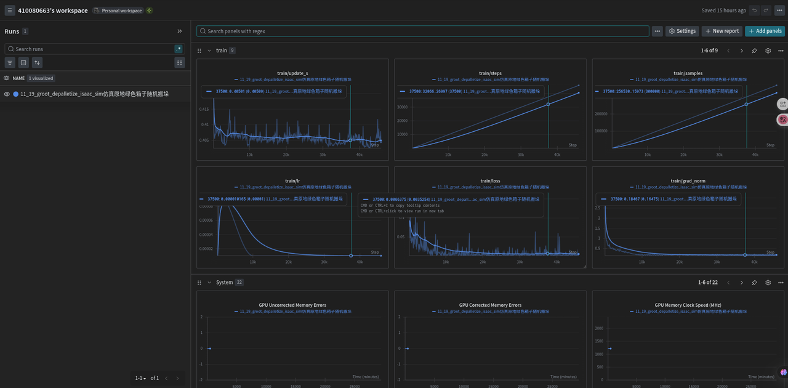
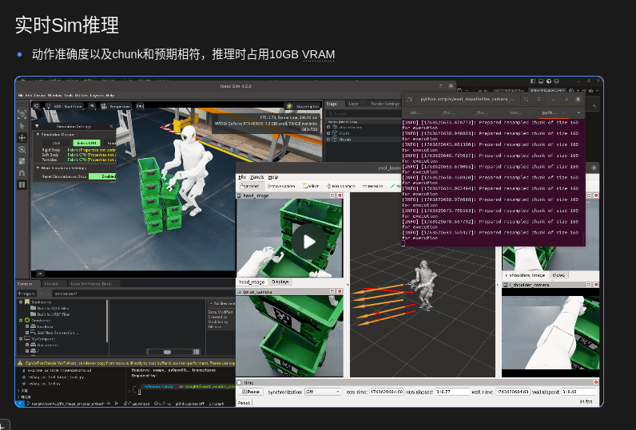

# Groot robot fine-turn

## Dataset prepare
* 将数据从v2.1的格式转换为v3.0格式
```bash
./convert_dataset.sh
```
## 可视化转换好的数据
```bash
conda activate lerobot_groot
lerobot-dataset-viz \                                    
    --repo-id /home/lab/lerobot_groot/lerobot_data/v3_0_dataset/1115_depalletize_left_mix_dagger_keyboard \ 
    --episode-index 0
```

## train
* 直接训练，batch_size=8，大概占用26G VRAM的大小
```bash
./train_groot.sh
```

## 推理eval
Groot Model Lerobot (0.4.2版本)
- 
- 微调40K (loss已经降到很低0.0003)
- State
  - STATE_COMPONENTS = ["J_q", "Claw_pos", "Com_z_pitch"]
- Aciton
  - ACTION_COMPONENTS = ["Left_arm", "Right_arm",  "Left_claw", "Right_claw", "Cmd_pose_z", "Cmd_pose_pitch"]

训练集验证
- 因为predict_action_chunk输出的值是归一化后的-1到1的值，所以实际执行动作的时候还得根据数据集当中的action dim的min和max进行反归一化才能获取到正确的值
eval on dataset
```bash
python scripts/eval_on_dataset.py \
    --ckpt-path /home/lab/lerobot_groot/outputs/train/11_19_groot_depalletize/checkpoints/040000/pretrained_model \
    --dataset-root /home/lab/lerobot_groot/lerobot_data/new_demo/1118_sim_depalletize \
    --episode 2 \
    --action-chunk-size 20 \
```

### Eval on dataset - state zero
```bash
python scripts/eval_on_dataset.py \
    --ckpt-path /home/lab/lerobot_groot/outputs/train/11_19_groot_depalletize/checkpoints/040000/pretrained_model \
    --dataset-root /home/lab/lerobot_groot/lerobot_data/new_demo/1118_sim_depalletize \
    --episode 2 \
    --action-chunk-size 20 \
    --state-zero
```

### Eval on dataset - image zero
```bash
python scripts/eval_on_dataset.py \
    --ckpt-path /home/lab/lerobot_groot/outputs/train/11_19_groot_depalletize/checkpoints/040000/pretrained_model \
    --dataset-root /home/lab/lerobot_groot/lerobot_data/new_demo/1118_sim_depalletize \
    --episode 2 \
    --action-chunk-size 20 \
    --image-zero
```
* 实验结果标明，Groot对于图像更为依赖，不依赖state，与预期相符
* 实时Sim推理
- 动作准确度以及chunk和预期相符，推理时占用10GB VRAM
* 