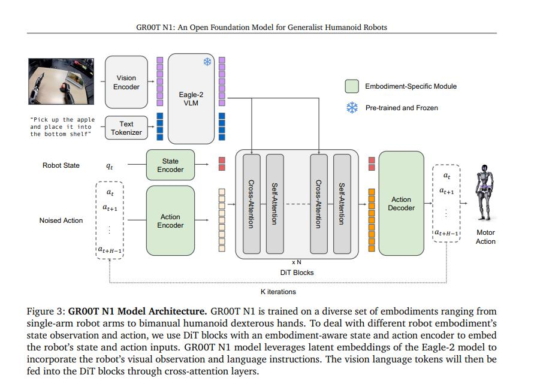

# Groot robot fine-turn
## env prepare
```bash
# 先安装lerobot其他库
# ubuntu22.04可以直接（pip install flash-attn==2.8.1），但是20.04要抓
pip install lerobot[groot]
pip install https://github.com/Dao-AILab/flash-attention/releases/download/v2.7.4.post1/flash_attn-2.7.4.post1+cu12torch2.6cxx11abiTRUE-cp310-cp310-linux_x86_64.whl

# 必装
pip install transformers
pip install peft

# 推理环境安装
pip3 install rospkg
pip3 install scipy 
cd /home/lab/kuavo-ros-control-rewACT/src/kuavo_humanoid_sdk && ./install.sh
pip3 install websockets 
pip3 install deprecated
```
## 模型架构分析
* 
### backbone原始定义 - vision encoder
SigLIP Vision Model (SiglipVisionModel)
- 来源：transformers.models.siglip.modeling_siglip.SiglipVisionModel
- 配置：SiglipVisionConfig
- 注意力实现：默认使用 flash_attention_2
```python
            if config.vision_config.model_type == "siglip_vision_model":
                config.vision_config._attn_implementation = "flash_attention_2"
                self.vision_model = SiglipVisionModel(config.vision_config)
            else:
                raise NotImplementedError(f"{config.vision_config.model_type} is not implemented.")
```
* `/home/lab/.cache/huggingface/lerobot/lerobot/eagle2hg-processor-groot-n1p5/config.json`
```json
    "vision_config": {
        "_attn_implementation_autoset": true,
        "attention_dropout": 0,
        "hidden_act": "gelu_pytorch_tanh",
        "hidden_size": 1152,
        "image_size": 224,
        "intermediate_size": 4304,
        "layer_norm_eps": 0.000001,
        "model_type": "siglip_vision_model",
        "num_attention_heads": 16,
        "num_channels": 3,
        "num_hidden_layers": 27,
        "patch_size": 14,
        "torch_dtype": "bfloat16"
    }
```
### backbone原始定义 - LLM
* 配置文件存放于`/home/lab/.cache/huggingface/lerobot/lerobot/eagle2hg-processor-groot-n1p5/config.json`
* 明确说明了使用`qwen3-1.7B`作为LLM，同时fine-turn使用fp16精度
```json
    "text_config": {
        "_attn_implementation_autoset": true,
        "_name_or_path": "Qwen/Qwen3-1.7B",
        "architectures": [
            "Qwen3ForCausalLM"
        ],
        "attention_bias": false,
        "attention_dropout": 0,
        "bos_token_id": 151643,
        "eos_token_id": 151645,
        "head_dim": 128,
        "hidden_act": "silu",
        "hidden_size": 2048,
        "initializer_range": 0.02,
        "intermediate_size": 6144,
        "max_position_embeddings": 40960,
        "max_window_layers": 28,
        "model_type": "qwen3",
        "num_attention_heads": 16,
        "num_hidden_layers": 28,
        "num_key_value_heads": 8,
        "rms_norm_eps": 0.000001,
        "rope_scaling": null,
        "rope_theta": 1000000,
        "sliding_window": null,
        "tie_word_embeddings": true,
        "torch_dtype": "bfloat16",
        "use_cache": false,
        "use_sliding_window": false,
        "vocab_size": 151680
    },
```
### Groot - action head 定义
* `/home/lab/.cache/huggingface/hub/models--nvidia--GR00T-N1.5-3B/snapshots/869830fc749c35f34771aa5209f923ac57e4564e/config.json`定义存放在Groot-N1.5-3B的原始路径下
#### 关于action head的定义
```json
  "action_head_cfg": {
    "action_dim": 32,
    "action_horizon": 16,
    "add_pos_embed": true,
    "backbone_embedding_dim": 2048,
    "diffusion_model_cfg": {
      "attention_head_dim": 48,
      "cross_attention_dim": 2048,
      "dropout": 0.2,
      "final_dropout": true,
      "interleave_self_attention": true,
      "norm_type": "ada_norm",
      "num_attention_heads": 32,
      "num_layers": 16,
      "output_dim": 1024,
      "positional_embeddings": null
    },
```
#### 关于Groot使用backbone的定义
* 重点关注`select_layer`的标签，意味着Groot在使用的backbone_cfg.select_layer：控制保留多少层（12层），实际参数量在0.91B 而不是1.7B
```json
  "backbone_cfg": {
    "eagle_path": "NVEagle/eagle_er-qwen3_1_7B-Siglip2_400M_stage1_5_128gpu_er_v7_1mlp_nops",
    "load_bf16": false,
    "project_to_dim": null,
    "reproject_vision": false,
    "select_layer": 12,
    "tune_llm": false,
    "tune_visual": true,
    "use_flash_attention": true
  },
```
---
## Dataset prepare
* 将数据从v2.1的格式转换为v3.0格式
```bash
./convert_dataset.sh
```
## 可视化转换好的数据
```bash
conda activate lerobot_groot
lerobot-dataset-viz \                                    
    --repo-id /home/lab/lerobot_groot/lerobot_data/v3_0_dataset/1115_depalletize_left_mix_dagger_keyboard \ 
    --episode-index 0
```

## train
* 直接训练，batch_size=8，大概占用26G VRAM的大小
```bash
./train_groot.sh

# 继续训练（从 8000 步继续，训练到 40000 步）
# 修改脚本中的 RESUME=true
RESUME=true bash train_groot.sh
```

## 推理eval
Groot Model Lerobot (0.4.2版本)
- 
- 微调40K (loss已经降到很低0.0003)
- State
  - STATE_COMPONENTS = ["J_q", "Claw_pos", "Com_z_pitch"]
- Aciton
  - ACTION_COMPONENTS = ["Left_arm", "Right_arm",  "Left_claw", "Right_claw", "Cmd_pose_z", "Cmd_pose_pitch"]

训练集验证
- 因为predict_action_chunk输出的值是归一化后的-1到1的值，所以实际执行动作的时候还得根据数据集当中的action dim的min和max进行反归一化才能获取到正确的值
eval on dataset
```bash
python scripts/eval_on_dataset.py \
    --ckpt-path /home/lab/lerobot_groot/outputs/train/11_19_groot_depalletize/checkpoints/040000/pretrained_model \
    --dataset-root /home/lab/lerobot_groot/lerobot_data/new_demo/1118_sim_depalletize \
    --episode 2 \
    --action-chunk-size 20 \
```

### Eval on dataset - state zero
```bash
python scripts/eval_on_dataset.py \
    --ckpt-path /home/lab/lerobot_groot/outputs/train/11_19_groot_depalletize/checkpoints/040000/pretrained_model \
    --dataset-root /home/lab/lerobot_groot/lerobot_data/new_demo/1118_sim_depalletize \
    --episode 2 \
    --action-chunk-size 20 \
    --state-zero
```

### Eval on dataset - image zero
```bash
python scripts/eval_on_dataset.py \
    --ckpt-path /home/lab/lerobot_groot/outputs/train/11_19_groot_depalletize/checkpoints/040000/pretrained_model \
    --dataset-root /home/lab/lerobot_groot/lerobot_data/new_demo/1118_sim_depalletize \
    --episode 2 \
    --action-chunk-size 20 \
    --image-zero
```
* 实验结果标明，Groot对于图像更为依赖，不依赖state，与预期相符
* 实时Sim推理
- 动作准确度以及chunk和预期相符，推理时占用10GB VRAM
* 